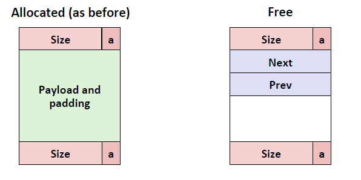

<!-- TOC -->

- [1.free block strategy](#1free-block-strategy)
    - [1.1 显示表（explicit free list)](#11-显示表explicit-free-list)
        - [1.1.1 显示表的两种插入规则（在free list 里面加新块）](#111-显示表的两种插入规则在free-list-里面加新块)
    - [1.2 独立分散表（根据大小）](#12-独立分散表根据大小)
- [2 垃圾回收策略](#2-垃圾回收策略)

<!-- /TOC -->
# 1.free block strategy
除了前一天的隐式表(implicit free list)：最原始的方法需要大量搜索时间(吞吐量)，以及内存利用率也不高(字节对齐)
衍生出更现代的方法

## 1.1 显示表（explicit free list)
已分配的和隐式表一样 非分配用双向链表链接(不一定地址连续) 空闲的表

### 1.1.1 显示表的两种插入规则（在free list 里面加新块）
* LIFO （last-in-first-out）
    * 把新块加入到free list 首部
    
    * 优点: 简单的常数时间
    * 缺点：研究表示内部碎片比地址顺序多
* 地址顺序
    * 把地址插入到两个地址（大小）之中
    * 优点：研究表明内部碎片少一点
    * 缺点：需要搜索

**summary** 显示表的搜索时间从隐式表的所有block到现在只是free的block，多了点内部碎片（两个指针)

## 1.2 独立分散表（根据大小）
根据size分配到地方 地方不够就找更大的size

优点：搜索时间更快 （吞吐量） 内存利用率高（内部碎片少 因为对应大小

# 2 垃圾回收策略
在动态语言差不多相同 （python java等）C++、C也有了 但是由于指针（会把大整数当指针)存在导致很多垃圾回收不了
**可以确定回收的垃圾，没有被指向或者间接指向**

最基础的 标记清理法（又可以利用字节对齐的3-4位bit）

