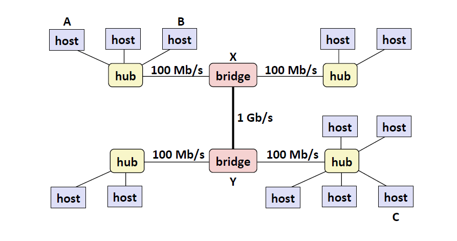
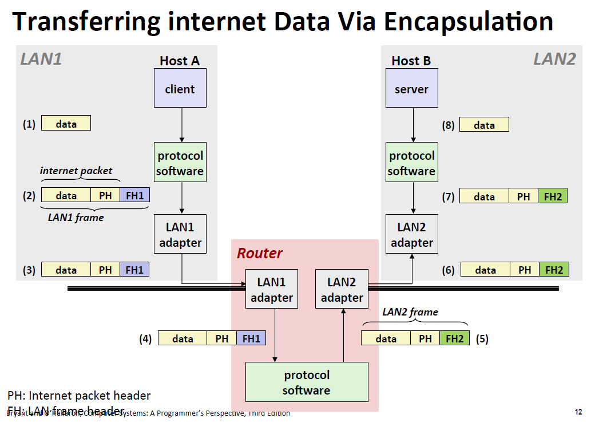
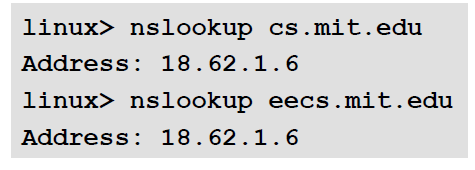
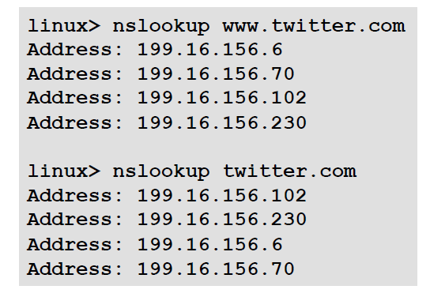
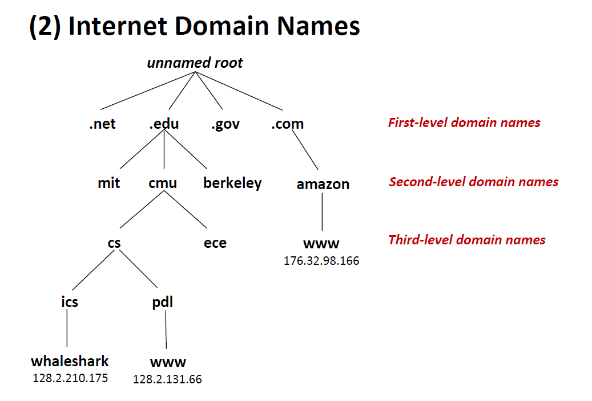

<!-- TOC -->

- [1. CS架构](#1-cs架构)
    - [1.1. Ethernet](#11-ethernet)
    - [1.2. protocol](#12-protocol)
    - [1.3. 程序员角度的网络](#13-程序员角度的网络)
        - [1.3.1. DNS(Domain Naming System)](#131-dnsdomain-naming-system)
        - [1.3.2. 通过端口连接（为了多用户 多服务器访问)](#132-通过端口连接为了多用户-多服务器访问)

<!-- /TOC -->
# 1. CS架构
## 1.1. Ethernet 
* host链接上hub上，hub上的东西，每个host都看得到mac地址（48bit）
* bridge 选择路线 

## 1.2. protocol
怎么样让不同网络 不同地方兼容
* IP（Internet Protocol)协议 主机到主机 （不可靠 和基本的命名解析）

* UDP (Unreliable Datagram Protocol)
使用IP 提供process to process 的数据包传输

* TCP (Transmisson Control Protocol)
使用IP 提供可靠的process to process 数据流 基于连接

## 1.3. 程序员角度的网络
* 主机是32bit IP address（IPv4) 128bit(IPV6)
* IP address 映射成域名 （被DNS解析)
### 1.3.1. DNS(Domain Naming System)
* 本地域名localhost
127.0.0.1
* 真正的本地域名hostname
* 可以多对一也可以一对多 或者多对多 也可以是动态的（把你分配到哪由DNS服务器决定分配给你一个更近的地址）

* 由于存在分级的机制 有些有效的域名没有对应一个host

### 1.3.2. 通过端口连接（为了多用户 多服务器访问)
* 公认提供特殊服务的端口

