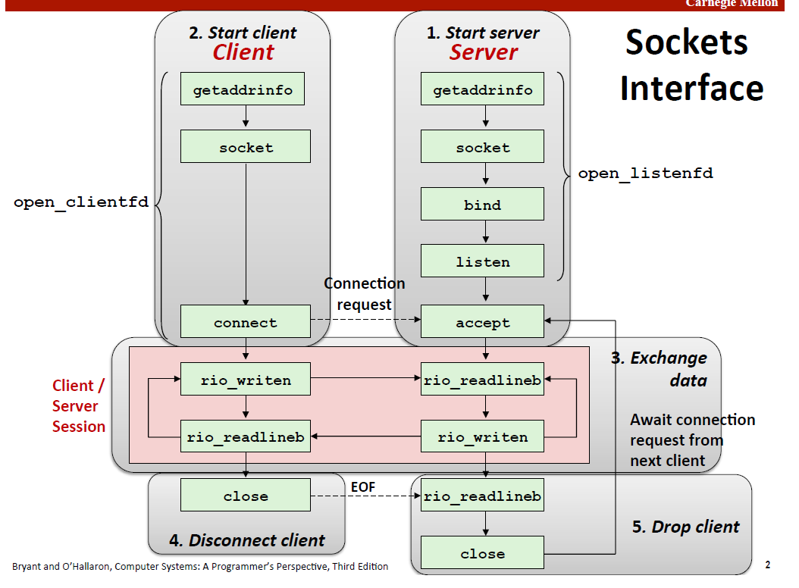
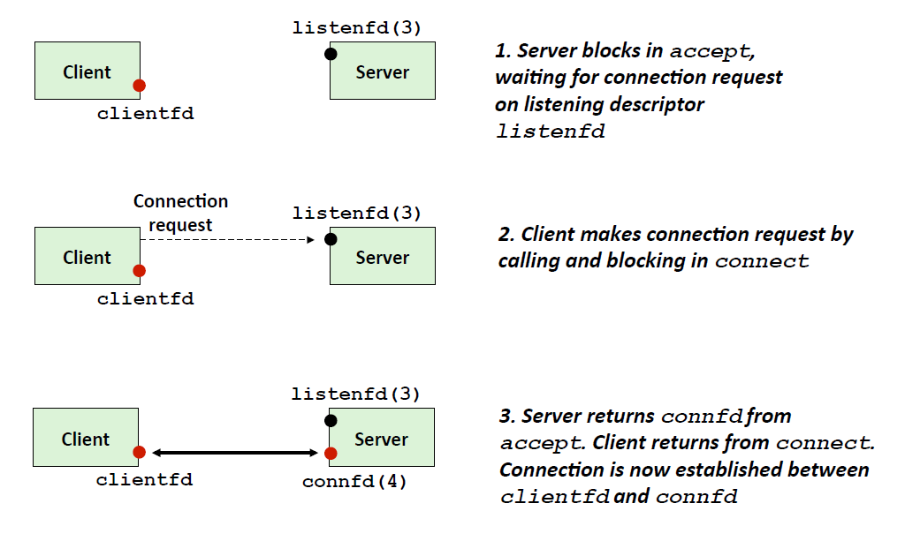
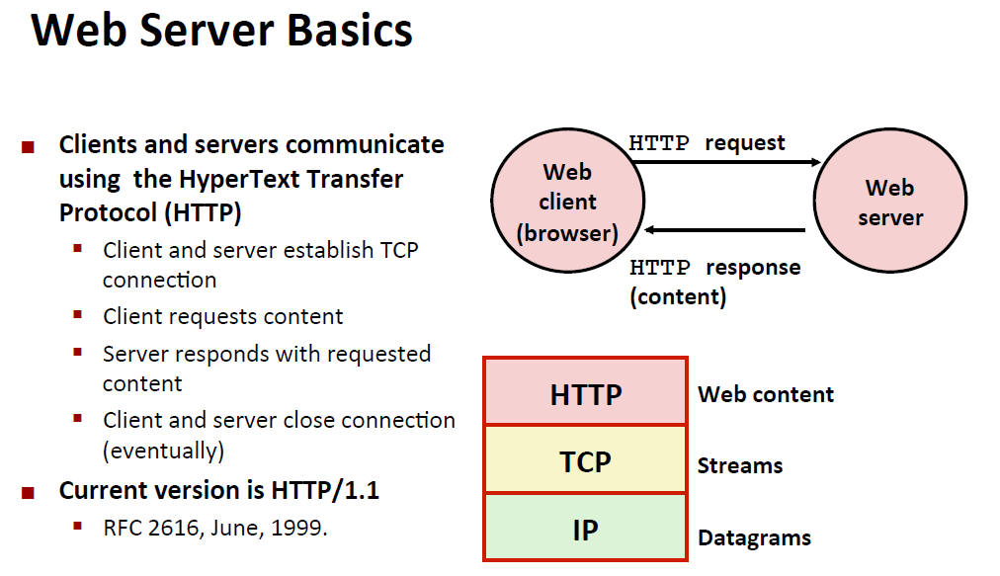
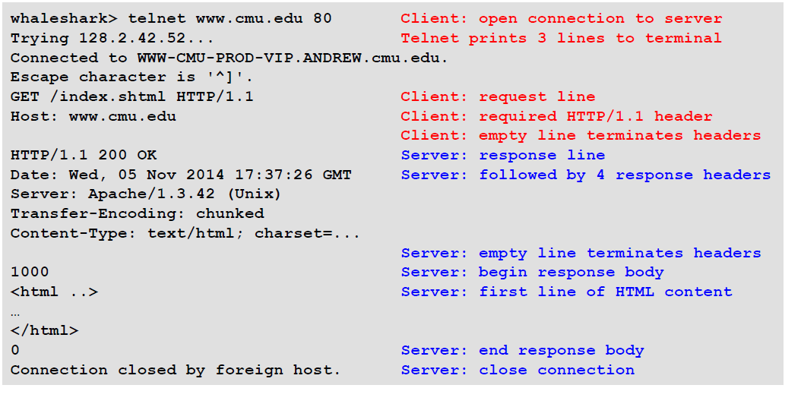
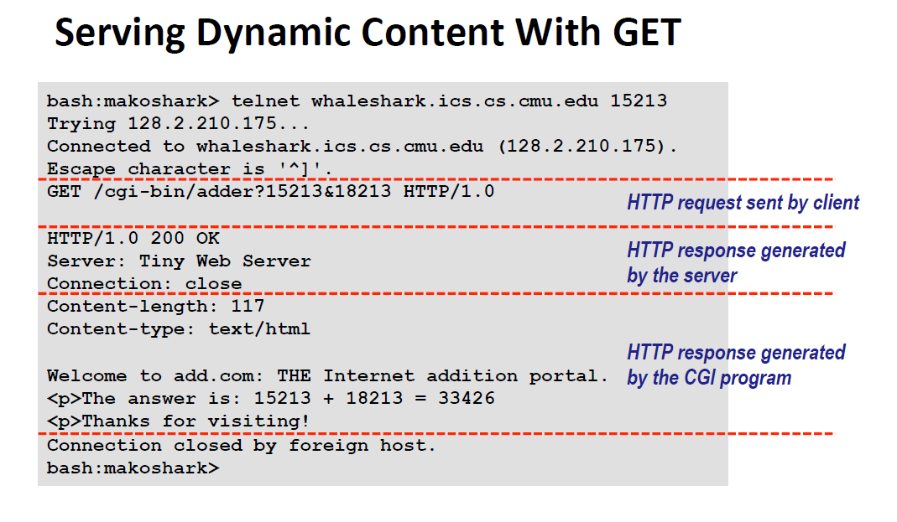
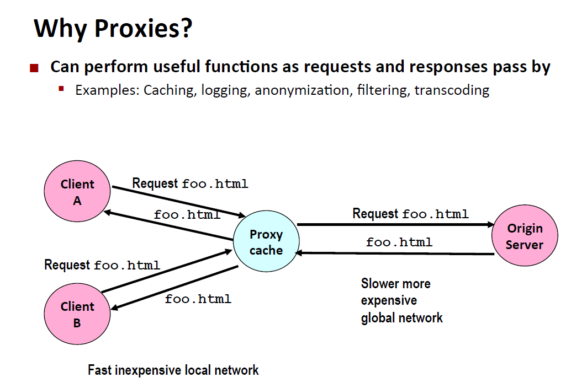

<!-- TOC -->

- [1. Normal TCP](#1-normal-tcp)
    - [1.1. Key part](#11-key-part)
- [2. Web server](#2-web-server)
    - [2.1. http协议](#21-http协议)
        - [2.1.1. URL](#211-url)
        - [2.1.2. http requests](#212-http-requests)
            - [2.1.2.1. Proxies](#2121-proxies)

<!-- /TOC -->
# 1. Normal TCP



## 1.1. Key part
client getaddrinfo （需要目标域名)
server getaddrinfo （不需要目标域名)

socket 返回整形（类似文件表述符，通信就是通过这个描述符来进行)


```c
int listen(int sockfd, int backlog);
```
返回的是从socket 转换的listenfd 在服务周期永远存在

**重点来了**
```c
int accept(int listenfd, SA *addr, int *addrlen);
```
也就是说accept 会产生一个额外的clientfd 多线程就会有多个clientfd 
如图


talnet 测试回响服务器（echo）

# 2. Web server

## 2.1. http协议


返回静态，或者动态的东西（需要执行程序)
### 2.1.1. URL

* Unique name for a file:URL (Universal Resource Locator)
* client 用前缀prefix导入 例如：http://www.cmu.edu:80
* server 用后缀决定静态动态内容 /index.html
如果不是特别的 就是/ 默认大多数是index.html


### 2.1.2. http requests
Request line: <method> <uri> <version>
A URL is a type of URI(Uniform Resource Identifier)


动态请求


#### 2.1.2.1. Proxies
