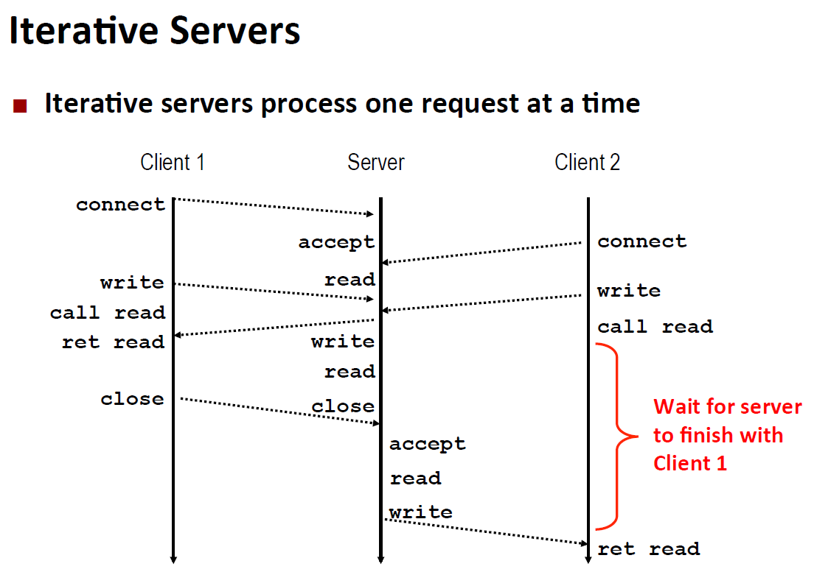
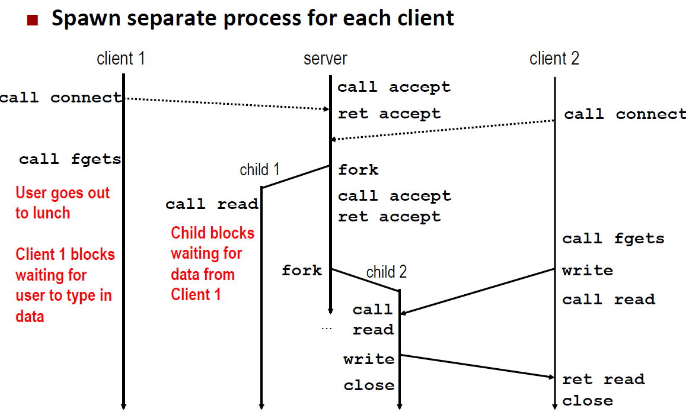
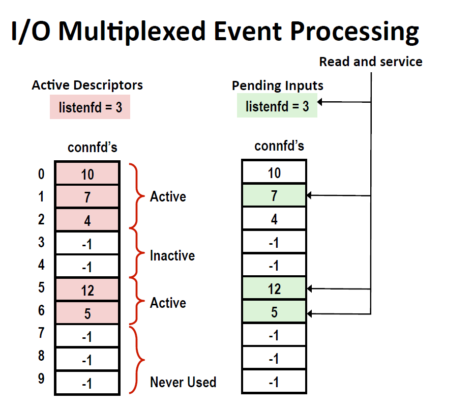
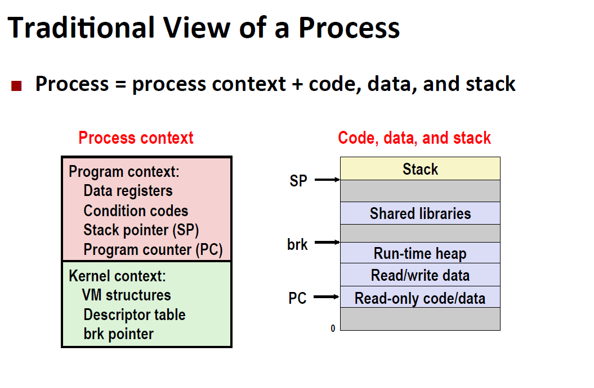
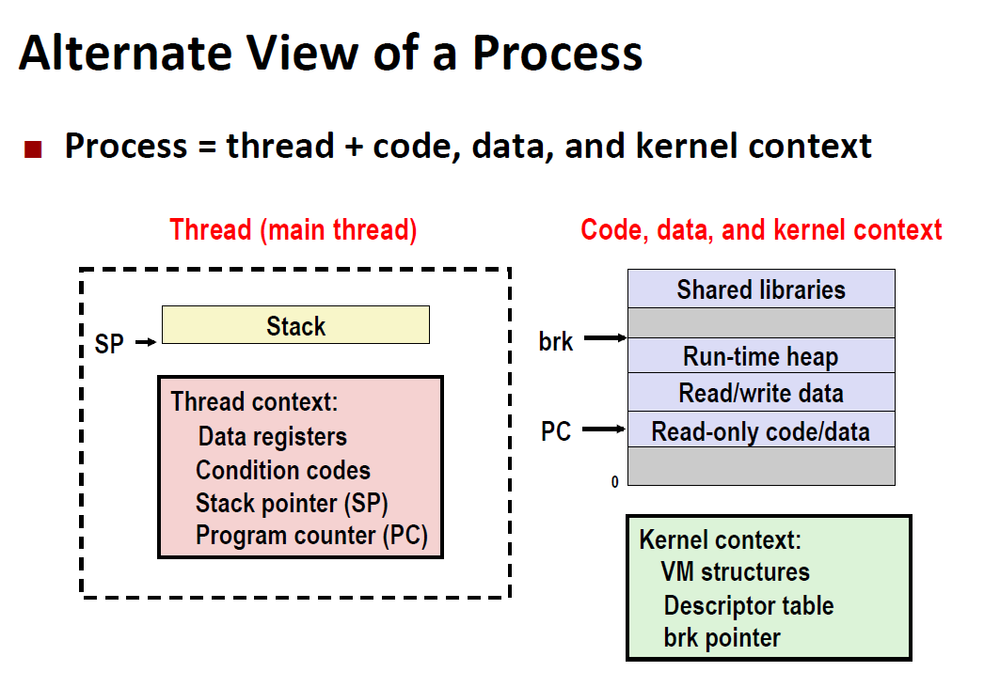
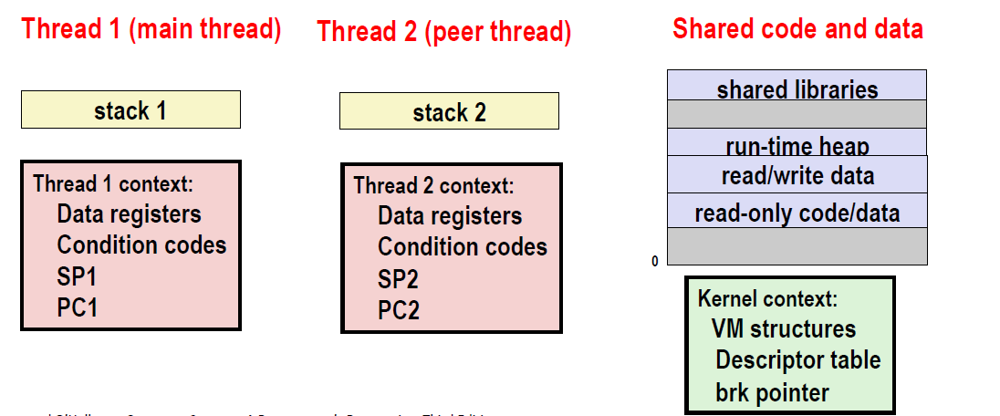
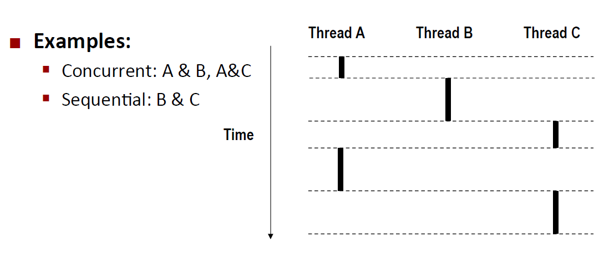
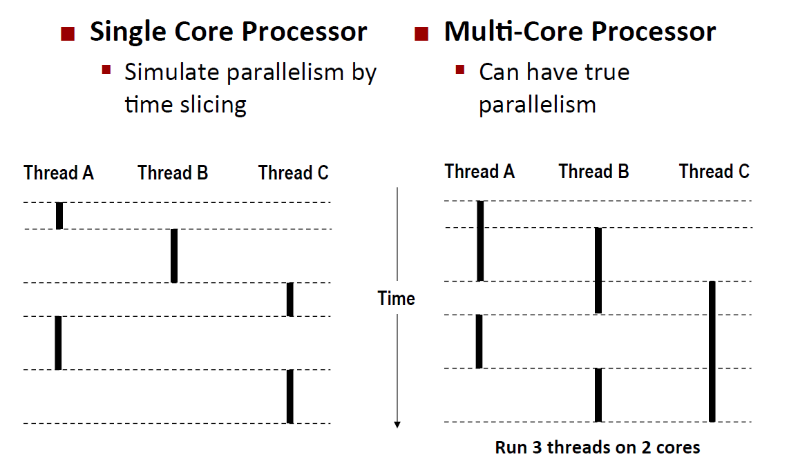

<!-- TOC -->

- [1. Probelms](#1-probelms)
- [2. Neccessity](#2-neccessity)
- [3. Approaches for Writing a concurrent program](#3-approaches-for-writing-a-concurrent-program)
    - [3.1. Progress-based](#31-progress-based)
        - [3.1.1. Features](#311-features)
        - [3.1.2. Pros and Cons](#312-pros-and-cons)
    - [3.2. Event-based](#32-event-based)
        - [3.2.1. Pros and Cons](#321-pros-and-cons)
    - [3.3. Thread-based](#33-thread-based)
        - [3.3.1. differences and similarities between process and thread](#331-differences-and-similarities-between-process-and-thread)
        - [3.3.2. thread mode](#332-thread-mode)
- [4. Summary](#4-summary)

<!-- /TOC -->
# 1. Probelms
* Races：结果取决于随机的调度(谁得到最后一张票,父进程在子进程加入列表前运行完了)
* Deadlock: 等待着一个永远不发生的信号到来（主程序printf，信号处理程序同时printf；交通谁先谁通过，但是同时到达四个，就不知道怎么走)
* livelock /starvations/ fairness: 两个进程内核总是安排一个

# 2. Neccessity

如果不并发 客户端2 connect 就算没建立连接也会return  要等待服务端结束前一个再accept
再发

# 3. Approaches for Writing a concurrent program
## 3.1. Progress-based

### 3.1.1. Features
* 内核自动调度
* 单独地址空间
如图


```C
int main(int argc, char **argv)!
{
int listenfd, connfd;
socklen_t clientlen;
struct sockaddr_storage clientaddr;

Signal(SIGCHLD, sigchld_handler);
listenfd = Open_listenfd(argv[1]);
while (1) {
clientlen = sizeof(struct sockaddr_storage);
connfd = Accept(listenfd, (SA *) &clientaddr, &clientlen);
if (Fork() == 0) {
Close(listenfd); /* Child closes its listening socket */
echo(connfd); /* Child services client */
Close(connfd); /* Child closes connection with client */
exit(0); /* Child exits */
}
Close(connfd); /* Parent closes connected socket (important!) */
}
}
```
**在程序里需要注意**：
每个父进程和子进程里面都有listenfd和connfd，refcnt=2 所以需要分别在父进程关闭connfd 子进程关闭listenfd
### 3.1.2. Pros and Cons
* pros：
    * 并发
    * 清晰的共享模式：单独的描述符，共享描述符表已经打开文件表，不共享全局变量地址
    * 简单
* cons
    * 额外进程开销
    * 不共享数据地址
## 3.2. Event-based
* 程序员调度多重的逻辑流
* 所有流 同样的地址
* I/O 复用
* 可以Debug

对所有输入都挂起读取


如图现在挂起的三个输入然后又三个listenfd 也就是事件来了我再去读
### 3.2.1. Pros and Cons
* pros：
    * 一个逻辑流，一个地址空间，可以Debug
    * 没有进程线程控制开销，高并发数必要（Node.js, nginx, Tornado）
* cons
    * 难code
    * 没利用多核

## 3.3. Thread-based 
* 内核自动调度
* 每个flow 同样的地址
* 混合了Progress-based Event-based

和进程很像






### 3.3.1. differences and similarities between process and thread

* similarities 
    * 都有自己的逻辑流
    * 都是上下文交换
* differences
    * thread 共享除了栈的数据 进程是不能共享全局数据
    * thread 的开销低 一半

### 3.3.2. thread mode
detached 不被其他thread打扰 内核回收
防止内存泄漏
注意分享给主thread的指针
# 4. Summary
* process 
    * 很难共享数据但是也避免了不想要的共享
    * 建立断开开销大
* event
    * 难编程
    * 可调试
    * 底层
    * 没利用多核
* thread 
    * 容易共享数据（太容易了）
    * 开销比 进程小
    * 很难debug （事件的发生不是可重复的）
    