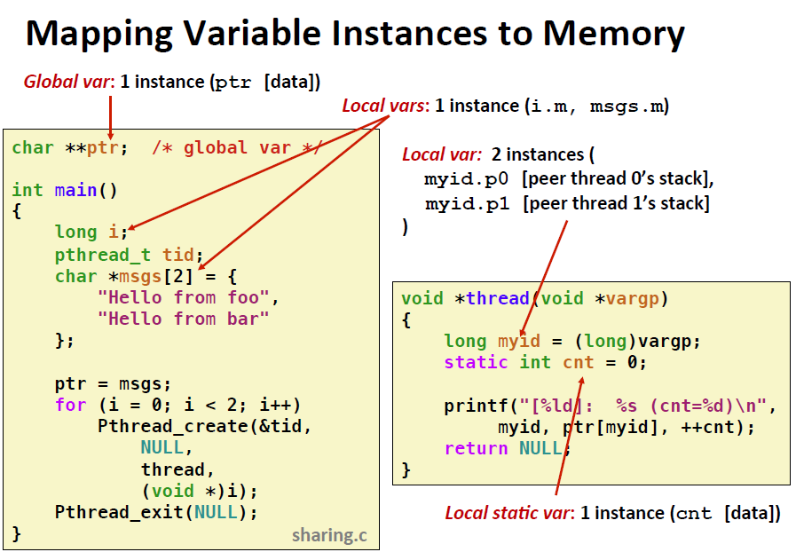
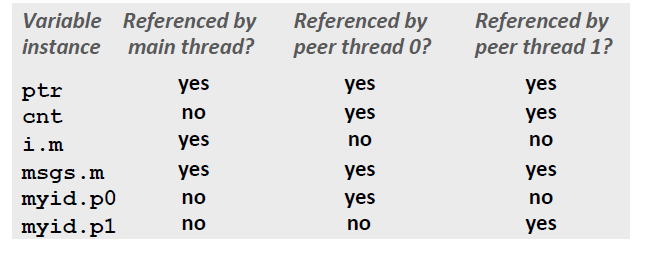
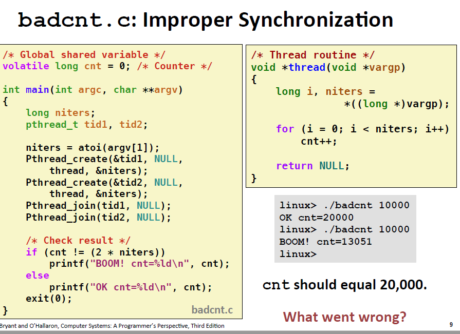
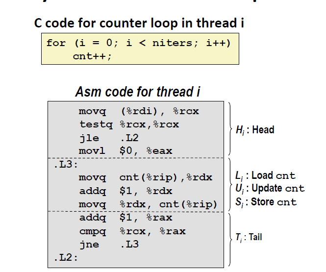
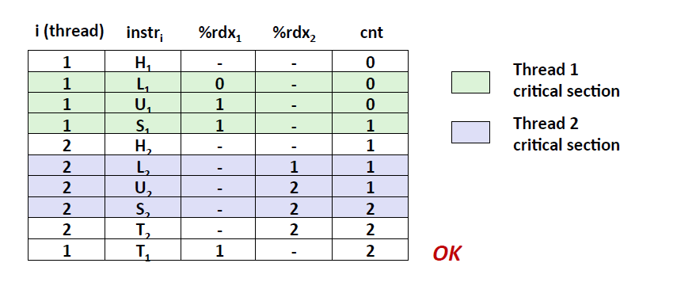
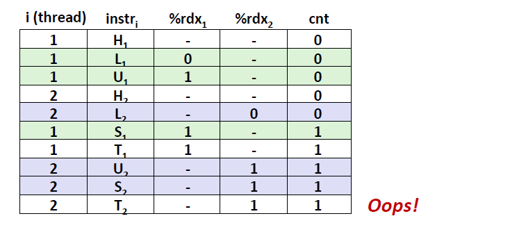
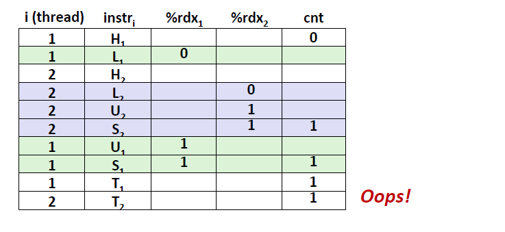
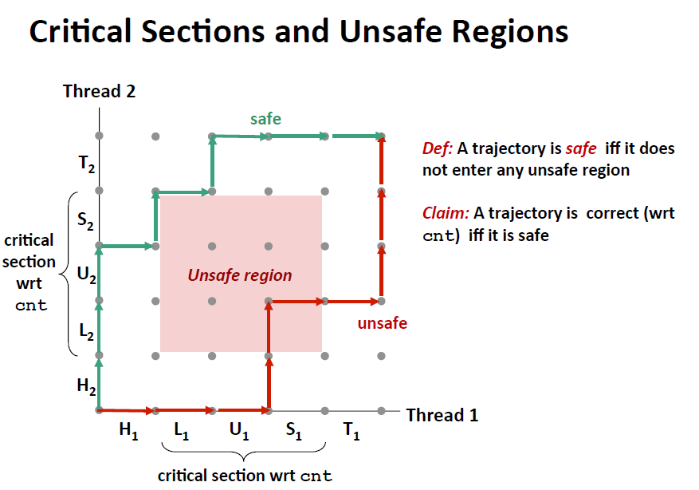
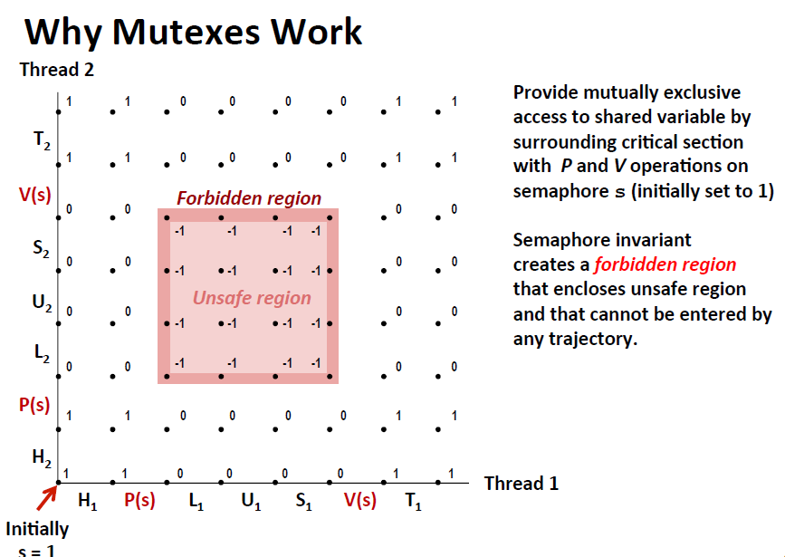
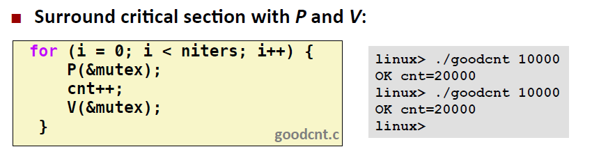

<!-- TOC -->

- [1. why synchronization](#1-why-synchronization)
- [2. what is shared variables in thread](#2-what-is-shared-variables-in-thread)
    - [2.1. 通过将变量放入内存搞清一个变量有多少个实例](#21-通过将变量放入内存搞清一个变量有多少个实例)
- [3. probelems](#3-probelems)
    - [3.1. 进程图分析](#31-进程图分析)
    - [3.2. 信号量（Semaphores）](#32-信号量semaphores)

<!-- /TOC -->
# 1. why synchronization
为了在关键步骤发生不必要的共享 导致错误
# 2. what is shared variables in thread
不一定是全局变量（全局变量只被自己引用就不是，只要是被多个进程指向的变量就是分享变量）
虽然每个线程栈独立，由于指针的特性，程序是能影响其他栈的

## 2.1. 通过将变量放入内存搞清一个变量有多少个实例
* global variables
放在全局区，在链接时链接器就只存放了同名全局变量的一个实例在虚拟内存里面
* local variables
非static 变量放在栈上 每个进程有自己的栈
* local static variables
放在全局区 虚拟内存里面只有一个实例

从share的角度

**ptr, cnt, and msgs are shared
n i and myid are not shared**

# 3. probelems
volatile 可以防止变量一直存在寄存器里面 （不写回）
交给内核完成上下文交换 只有系统调用和定时器中断 所以数字大的话错误概率就高

**反汇编** 发现改变cnt需要三个步骤 只有最后一个步骤写回

正确顺序

可能的顺序

## 3.1. 进程图分析

## 3.2. 信号量（Semaphores）
Monitors (Java)
Semaphores 是非负全局***同步***变量。

因此可以通过PV加减信号量来保证不会进入危险区域

* P 减少 信号量 如果信号量是0 那么就会阻塞等待V增加信号量
* V 不会阻塞 只是在增加后 会随机选择 多个阻塞线程中的一个

