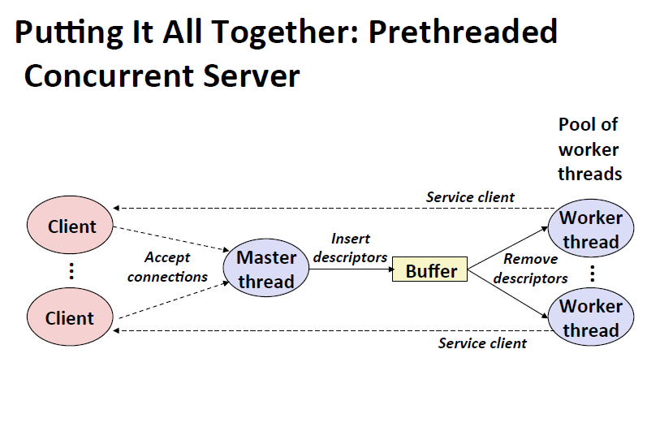

<!-- TOC -->

- [1. use semaphores to protectd shared variables](#1-use-semaphores-to-protectd-shared-variables)
    - [1.1. two classical examples](#11-two-classical-examples)
        - [1.1.1. the producer-consumer probelm](#111-the-producer-consumer-probelm)
        - [1.1.2. reader writer problem](#112-reader-writer-problem)
    - [1.2. put it together](#12-put-it-together)
- [2. 线程安全](#2-线程安全)
    - [2.1. unsafe types functions](#21-unsafe-types-functions)
        - [2.1.1. class1 没保护共享变量](#211-class1-没保护共享变量)
        - [2.1.2. class2 依赖全局变量状态](#212-class2-依赖全局变量状态)
        - [2.1.3. class3 返回一个静态变量的地址](#213-class3-返回一个静态变量的地址)
        - [2.1.4. class4 调用任何线程不安全的函数在函数里面](#214-class4-调用任何线程不安全的函数在函数里面)
        - [2.1.5. 重定位函数（没有任何shared变量）](#215-重定位函数没有任何shared变量)
    - [2.2. problems](#22-problems)
        - [2.2.1. races （不能假设一个线程先到达一个点在另一个线程到达那个点前）](#221-races-不能假设一个线程先到达一个点在另一个线程到达那个点前)
        - [2.2.2. deadlock（两个线程互相等待对方释放）](#222-deadlock两个线程互相等待对方释放)

<!-- /TOC -->
# 1. use semaphores to protectd shared variables
mutex（互斥量）
## 1.1. two classical examples
### 1.1.1. the producer-consumer probelm


生产者等待buffer的空槽 插入items
消费者等待items 将其重buffer中移除 告知生产者
图像渲染帧：帧被创建 然后在被渲染
图形页面驱动：鼠标等事件发生 然后响应

```C
/* Insert item onto the rear of shared buffer sp */
void sbuf_insert(sbuf_t *sp, int item)
{
P(&sp->slots); /* Wait for available slot */
P(&sp->mutex); /* Lock the buffer */
sp->buf[(++sp->rear)%(sp->n)] = item; /* Insert the item */
V(&sp->mutex); /* Unlock the buffer */
V(&sp->items); /* Announce available item */
}
```
```C
/* Remove and return the first item from buffer sp */
int sbuf_remove(sbuf_t *sp)
{
int item;
P(&sp->items); /* Wait for available item */
P(&sp->mutex); /* Lock the buffer */
item = sp->buf[(++sp->front)%(sp->n)]; /* Remove the item */
V(&sp->mutex); /* Unlock the buffer */
V(&sp->slots); /* Announce available slot */
return item;
}
```

### 1.1.2. reader writer problem
读者只读 只有作者有权利写
* reader优先
当作者写完buffer后，同时等待时，读者优先 
* writer优先
当作者写完buffer后，同时等待时，作者优先 

## 1.2. put it together

**预线程并发服务器**好处显然：少了创建销毁进程或者线程 在buffer操作简单 效率高

# 2. 线程安全
被线程函数调用的函数必须是线程安全的 
**定义**：被多个并发线程调用也无论多少次都能产生正确结果

## 2.1. unsafe types functions

### 2.1.1. class1 没保护共享变量
改进：使用mutex 然后PV保护就行
问题：太慢了 同步

### 2.1.2. class2 依赖全局变量状态
比如rand函数 依赖种子 原理上种子不变随机数不变 但是如图next很有可能在调用的时候被改变（很多lic库的在写的时候还没有线程）

```c
static unsigned int next = 1;

/* rand: return pseudo-random integer on 0..32767 */
int rand(void)
{
next = next*1103515245 + 12345;
return (unsigned int)(next/65536) % 32768;
}

/* srand: set seed for rand() */
void srand(unsigned int seed)
{
next = seed;
}
```
改进：用指针保存seed代替全局变量
```c
/* rand_r - return pseudo-random integer on 0..32767 */

int rand_r(int *nextp)
{
*nextp = *nextp * 1103515245 + 12345;
return (unsigned int)(*nextp/65536) % 32768;
}
```

### 2.1.3. class3 返回一个静态变量的地址
比如time 返回的一直是一个相同的地址 只不过上面的字符串不一样
改进：重写库（难） 或者重写调用 把静态变量的地方改成每个独有的地址

### 2.1.4. class4 调用任何线程不安全的函数在函数里面

### 2.1.5. 重定位函数（没有任何shared变量）


所有Standard C的函数都是线程安全的

## 2.2. problems
### 2.2.1. races （不能假设一个线程先到达一个点在另一个线程到达那个点前）


### 2.2.2. deadlock（两个线程互相等待对方释放）


