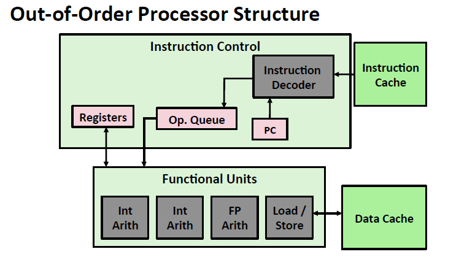
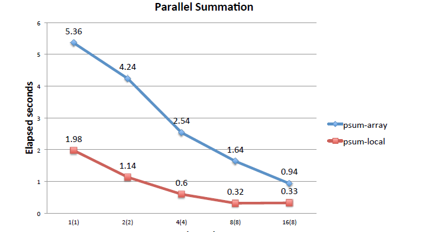

# 多核和超线程

现在的计算机都是并行流水线

超线程(hpyerthreading)意味着在单核的情况下多个线程同时走

# 并行加法
目标：加0到n-1
想法：使用多个进程用互斥量来加globel sum
结果

改进：信号同步是很慢的，每个进程单独使用数组不同步,主进程等待所有进程结束然后相加
结果:

再改进：不用每次改数组，而是用局部变量（寄存器)累加，最后给数组

可以看到这里超线程并没有帮到我们（本身就在很好的使用寄存器)
**但是实际中的程序复杂的多，并不是这么简单利用**

# Amdahl’s Law（阿姆达尔定律）
研究一部分性能提升（使用并行)对总体性能的影响

# 快速排序（利用并行）
原来的 排左 排右

用线程递归  直到够小 

还要注意的是碎片太小 就不够并行性 太大就线程开销就太大了

# 线程连续性法则（Thread consistency）
决定了不会出现1，100  或者100,1

但是如果有不耦合的缓存，就可能出现。

## Snoopy Cache(史努比缓存)
对缓存进行了三种标记

