# 版本控制 

## 版本控制是什么
记录若干文件变化

## 为什么版本控制
回溯状态 对比文件 找BUG

## 本地版本控制
直接复制目录 或者利用本地数据库
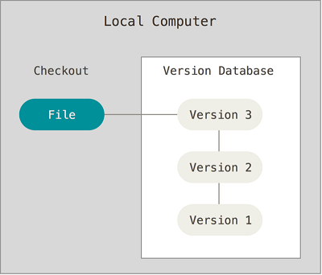

## 集中化版本控制
单一集中服务器 去服务器取得最新 （单点故障 联网）


## 分布式版本控制
GIT 客户端不只提取最新文件快照，而把代码仓库完整镜像。
大家不用联网， 将更改推送他人就可以 ，实际中可能需要一个
中心服务器 只是为了推送更改


# GIT

## 与其他版本管理区别

差别： 对待数据方式

### 其他版本控制

提交更新文件用Delta表示
**如何得到最新版本**
通过原始文件和加减得到最终文件


### GIT控制
<font color="blue">快照流 对全部文件制作快照，保存索引,如果文件没有更改就不再重新存储 只保留一个链接指向之前存储 </font> 


#### GIT三种状态

1. **已提交（committed）**：数据已经安全的保存在本地数据库中。
2. **已修改（modified**）：已修改表示修改了文件，但还没保存到数据库中。
3. **已暂存（staged）**：表示对一个已修改文件的当前版本做了标记，使之包含在下次提交的快照中。

#### Git 三个工作区域

* Git 仓库(.git directoty)、
* 工作目录(Working Directory) 
* 暂存区域(Staging Area) 。

#### GIT工作流程
1. 在工作目录中修改文件。
2. 暂存文件，将文件的快照放入暂存区域。
3. 提交更新，找到暂存区域的文件，将快照永久性存储到 Git 仓库目录。

# GIT入门
>https://backlog.com/git-tutorial/cn/intro/intro2_3.html


## 基础
设置账户
```c
git config --global user.name "<用户名>"
git config --global user.email "<电子邮件>"
```

查看当前设置
```c
git config --list 
```

按照以下步骤把新创建的tutorial目录设置到Git数据库。

```c
mkdir tutorial
cd tutorial
git init
```

请使用status命令确认工作树和索引的状态。

```c
git status
```
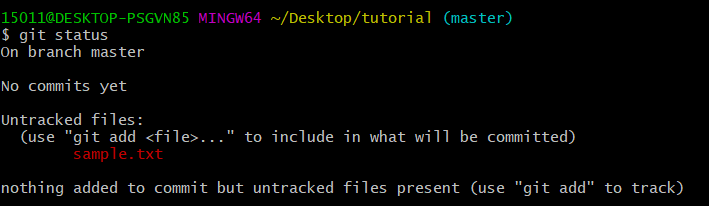
新建一个 sample.txt
从status响应我们可以看到‘sample.txt’目前不是历史记录对象。请首先把‘sample.txt’加入到索引，就可以追踪它的变更了。
```c
git add sample.txt
git status
```
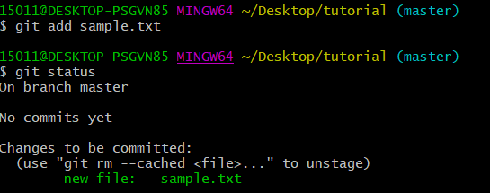


```c
git commit -m "first commit"
git status
git log
```
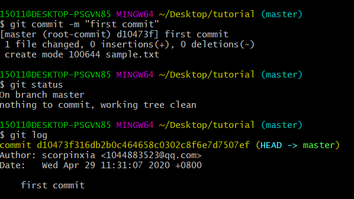

## 共享数据库

### 将本地数据库修改记录共享到远程PUSH
创建一个数据库
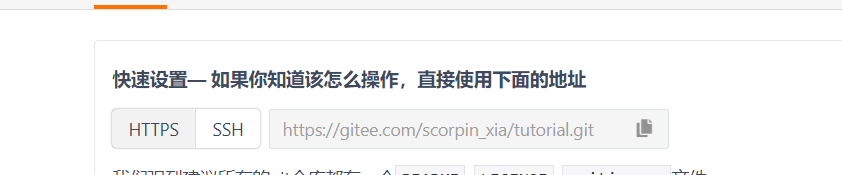


```c
git remote add origin https://gitee.com/scorpin_xia/tutorial.git
```
添加远程数据库 名称origin

```c
git push -u origin master
```
如果您指定了-u选项，那么下一次推送时就可以省略分支名称了。但是，首次运行指令向空的远程数据库推送时，必须指定远程数据库名称和分支名称。

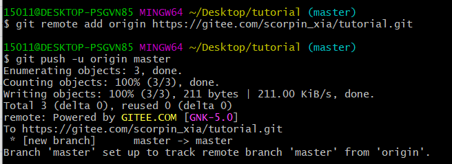


### 克隆远程数据库 clone

```c
git clone https://gitee.com/scorpin_xia/tutorial.git tutorial2
```

### 推送变更
当在克隆的数据库目录执行推送时，您可以省略数据库和分支名称。


```c
git add sample.txt
git commit -m "添加add的说明"
git push
```
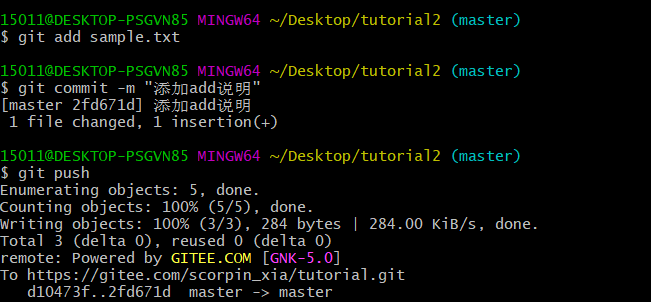

### 从远程数据库 pull 更新

```c
git pull origin master
git log
```
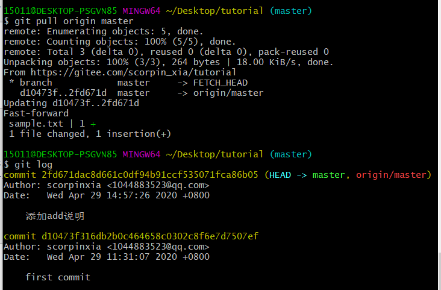


# 整合修改记录

## pull 冲突状态
在执行pull之后，进行下一次push之前，如果其他人进行了推送内容到远程数据库的话，那么你的push将被拒绝。


```c
//tutorial
git add sample.txt
git commit -m "添加commit的说明"
//tutorial2
git add sample.txt
git commit -m "添加pull的说明"
git push

//tutorial
git push
```
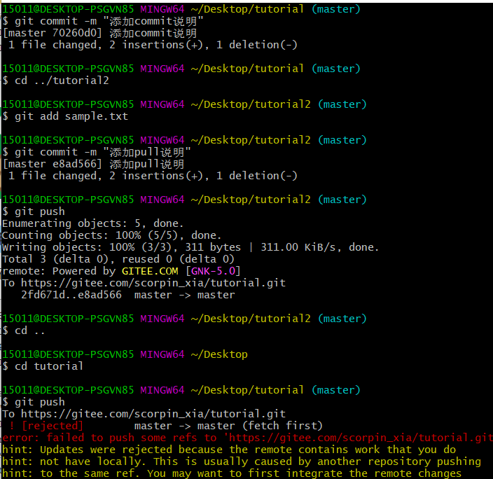


## 解决冲突
```c
//tutorial
git push origin master
cat sample.txt

git add sample.txt
git commit -m "合并"

git log --graph --oneline
```
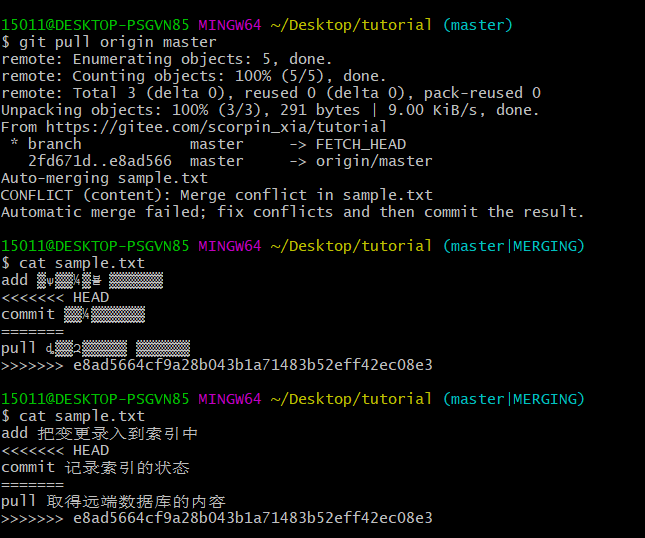
指定--graph选项，能以文本形式显示更新记录的流程图。指定--oneline选项，能在一行中显示提交的信息。
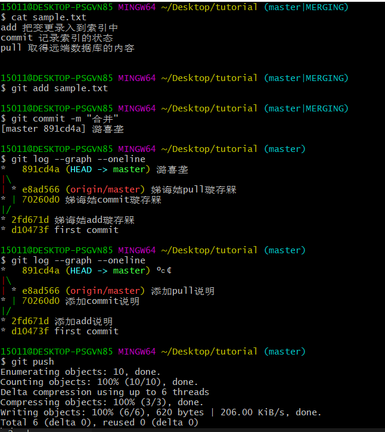