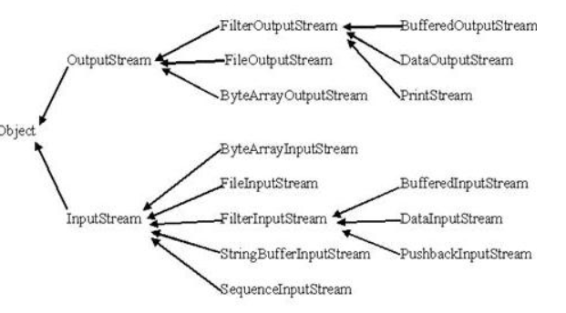

<!-- TOC -->

- [1. ***只写模糊的***](#1-只写模糊的)
    - [1.1. 正则表达式](#11-正则表达式)
        - [1.1.1. Pattern类](#111-pattern类)
        - [1.1.2. Matcher类](#112-matcher类)
    - [1.2. 可变参数 （有点像指针)](#12-可变参数-有点像指针)
    - [1.3. finalize()方法](#13-finalize方法)
    - [1.4. Stream File IO](#14-stream-file-io)
        - [1.4.1. 控制台输入 System.in对象](#141-控制台输入-systemin对象)
        - [1.4.2. 控制台输入 System.out对象](#142-控制台输入-systemout对象)
    - [1.5. 读写文件](#15-读写文件)
        - [1.5.1. FileOutputStream](#151-fileoutputstream)
        - [1.5.2. 目录](#152-目录)
    - [1.6. Scanner类](#16-scanner类)
    - [1.7. try catch 异常处理](#17-try-catch-异常处理)

<!-- /TOC -->
# 1. ***只写模糊的***

## 1.1. 正则表达式

### 1.1.1. Pattern类
pattern对象是一个正则表达式的编译表示。Pattern类没有公共构造方法。要创建一个Pattern对象，你必须首先调用其公共静态编译方法，它返回一个Pattern对象。该方法接受一个正则表达式作为它的第一个参数。
### 1.1.2. Matcher类
Matcher类：
Matcher对象是对输入字符串进行解释和匹配操作的引擎。与Pattern类一样，Matcher也没有公共构造方法。你需要调用Pattern对象的matcher方法来获得一个Matcher对象。

## 1.2. 可变参数 （有点像指针)
```JAVA
public class VarargsDemo {

   public static void main(String args[]) {
      // 调用可变参数的方法
	  printMax(34, 3, 3, 2, 56.5);
      printMax(new double[]{1, 2, 3});
   }

   public static void printMax( double... numbers) {
   if (numbers.length == 0) {
      System.out.println("No argument passed");
      return;
   }

   double result = numbers[0];

   for (int i = 1; i <  numbers.length; i++)       if (numbers[i] >  result)
      result = numbers[i];
      System.out.println("The max value is " + result);
   }
}
```
## 1.3. finalize()方法
Java允许定义这样的方法，它在对象被垃圾收集器析构(回收)之前调用，这个方法叫做finalize( )，它用来清除回收对象。

## 1.4. Stream File IO

### 1.4.1. 控制台输入 System.in对象
read() readline
```JAVA
// 使用 BufferedReader 在控制台读取字符
import java.io.*;
public class BRReadLines {
   public static void main(String args[]) throws IOException
   {
      // 使用 System.in 创建 BufferedReader 
      BufferedReader br = new BufferedReader(new
                              InputStreamReader(System.in));
      String str;
      System.out.println("Enter lines of text.");
      System.out.println("Enter 'end' to quit.");
      do {
         str = br.readLine();
         System.out.println(str);
      } while(!str.equals("end"));
   }
}
```


### 1.4.2. 控制台输入 System.out对象
write()不常用 因为print() 和println()好用

## 1.5. 读写文件 


### 1.5.1. FileOutputStream
使用字符串类型的文件名来创建一个输出流对象：
```JAVA
OutputStream f = new FileOutputStream("C:/java/hello")
```
也可以使用一个文件对象来创建一个输出流来写文件。我们首先得使用File()方法来创建一个文件对象：
```JAVA
File f = new File("C:/java/hello");
OutputStream f = new FileOutputStream(f);
```


### 1.5.2. 目录
mkdir()

## 1.6. Scanner类

## 1.7. try catch 异常处理


