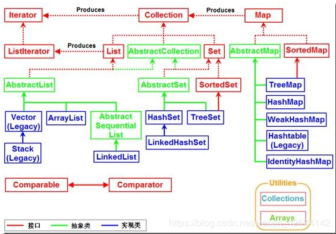
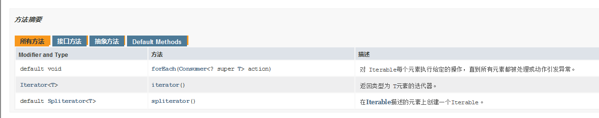

# 总图
这个图比较漂亮

# Iterable 超接口
Iterable   有个方法 获得Iterator   以及foreach jdk1.8

# Collection接口
继承了Iterable 实际上需求的是Iterator接口去得到遍历功能

不同的Collection子类对于有序性、重复性、null、线程同步都有不同的策略。

## AbstactCollection 抽象类
提供骨架实现 减少实现此接口的工作量 **不包括Hashcode和Stream()**

## list
* 序列 
* 特殊的迭代器，称为 ListIterator，迭代器加入了元素插入和替换，以及双向访问功能。还提供了一个方法(如下)来获取从列表中指定位置开始的列表迭代器。
* 迭代索引访问优先于索引
* 搜索比较慢 

### AbstactList
与AbstactCollection 同理

#### ArrayList
具体实现类 可变大小数组 不同步
**适合随机查找和遍历，不适合插入和删除。**

#### Vector 
不怎么用 比ArrayList慢
##### Stack
栈

#### AbstactSequentialList 

### LinkedList
* LinkedList是用链表结构存储数据的，**很适合数据的动态插入和删除，随机访问和遍历速度比较慢。**
* 它还实现了Deque接口，专门用于操作表头和表尾元素，可以当作堆栈、队列和双向队列使用。

## Set接口
就像数学意义的集合一样 不能重复 无序
* Set判断两个对象相同不是使用"=="运算符，而是根据equals方法。
* equals 要有效 构造函数输入的也不能重复

### HashSet
* HashSet使用HASH算法来存储集合中的元素，因此具有良好的存取和查找性能
* HashSet集合判断两个元素相等的标准是两个对象通过equals()方法比较相等，并且两个对象的hashCode()方法的返回值相等

#### LinkedHashSet
* LinkedHashSet集合也是根据元素的hashCode值来决定元素的存储位置，但和HashSet不同的是，它同时使用链表维护元素的次序，这样使得元素看起来是以插入的顺序保存的。 
* 适合遍历 其他性能小于Hashset

### SortSet 接口
#### TreeSet

# MAP接口
单独的接口 与Collections 没有实际继承关系

**但是MAP的所有key 是一个set对象 value 是一个collection的子类对象**

## HashMap
两个key通过equals()方法比较返回true、 同时两个key的hashCode值也必须相等
### LinkedHashMap

## Comparable
compareTo(T o)

## Comparator
函数接口 compare(T o1,T o2)