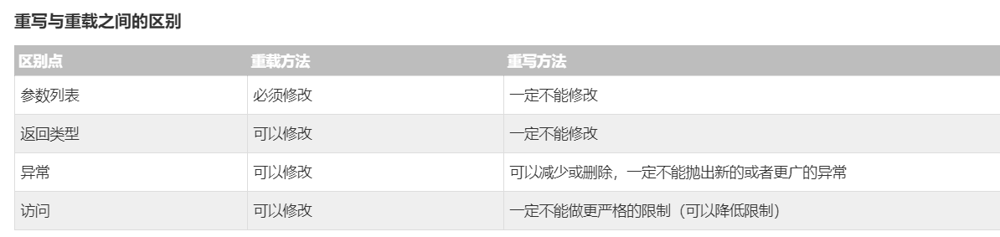

<!-- TOC -->

- [1. 继承](#1-继承)
    - [1.1. extends](#11-extends)
    - [1.2. instanceof 关键字](#12-instanceof-关键字)
    - [1.3. implements](#13-implements)
- [2. 重写和重载](#2-重写和重载)
    - [2.1. Override 重写](#21-override-重写)
    - [2.2. Overload 重载](#22-overload-重载)
    - [2.3. 二者区别](#23-二者区别)
- [3. 抽象类](#3-抽象类)
    - [3.1. 抽象方法](#31-抽象方法)
- [4. 封装](#4-封装)
- [5. 接口](#5-接口)
    - [5.1. 接口与类相似点：](#51-接口与类相似点)
    - [5.2. 接口与类的区别：](#52-接口与类的区别)
    - [5.3. implements](#53-implements)
    - [5.4. 标记接口](#54-标记接口)
- [6. 包](#6-包)
    - [6.1. 作用](#61-作用)
    - [6.2. tips](#62-tips)
- [7. 多态](#7-多态)

<!-- /TOC -->
# 1. 继承
## 1.1. extends
IS-A关系
## 1.2. instanceof 关键字
可以使用 instanceof 运算符来检验Mammal和dog对象是否是Animal类的一个实例。


## 1.3. implements

Java只支持单继承（继承基本类和抽象类），但是我们可以用接口来实现（多继承接口来实现）,脚本结构如：
```JAVA
public class Apple extends Fruit implements Fruit1, Fruit2{}
```

# 2. 重写和重载

## 2.1. Override 重写

子类重写父类 
用到的父类被重写方法 super


## 2.2. Overload 重载

## 2.3. 二者区别


# 3. 抽象类
类没有足够的信息描绘对象 （抽象类）abstract
继承使用

## 3.1. 抽象方法
继承抽象类的子类必须重写此 方法
```JAVA
public abstract double computePay();
```


# 4. 封装
Getter Setter 类的private数据

这样的好处 这种数据的访问被严格控制 而且可以修改实现而不是调用 


# 5. 接口

interface
与类的异同 

## 5.1. 接口与类相似点：
一个接口可以有多个方法。
* 接口文件保存在.java结尾的文件中，文件名使用接口名。
* 接口的字节码文件保存在.class结尾的文件中。
* 接口相应的字节码文件必须在与包名称相匹配的目录结构中。

## 5.2. 接口与类的区别：
* 接口不能用于实例化对象。
* 接口没有构造方法。
* 接口中所有的方法必须是抽象方法。(隐式抽象不用abstract)
* 接口不能包含成员变量，除了static和final变量。
* 接口不是被类继承了，而是要被类实现。
* 接口支持多重继承。

## 5.3. implements 
实现接口
```JAVA
public class MammalInt implements Animal
```

在实现接口的时候，也要注意一些规则：

* 一个类可以同时实现多个接口。
* 一个类只能继承一个类，但是能实现多个接口。
* 一个接口能继承另一个接口，这和类之间的继承比较相似。(而且可以多重继承)

## 5.4. 标记接口
没有任何方法的接口
```JAVA
package java.util;
public interface EventListener
{}
```
目的
* 建立一个公共的父接口：
正如EventListener接口，这是由几十个其他接口扩展的Java API，你可以使用一个标记接口来建立一组接口的父接口。例如：当一个接口继承了EventListener接口，Java虚拟机(JVM)就知道该接口将要被用于一个事件的代理方案。

* 向一个类添加数据类型：
这种情况是标记接口最初的目的，实现标记接口的类不需要定义任何接口方法(因为标记接口根本就没有方法)，但是该类通过多态性变成一个接口类型。

# 6. 包
如果一个源文件中没有使用包声明，那么其中的类，函数，枚举，注释等将被放在一个无名的包（unnamed package）中。通常小写避免与类冲突。
## 6.1. 作用

包的作用

* 把功能相似或相关的类或接口组织在同一个包中，方便类的查找和使用。
* 如同文件夹一样，包也采用了树形目录的存储方式。同一个包中的类名字是不同的，不同的包中的类的名字是可以相同的，当同时调用两个不同包中相同类名的类时，应该加上包名加以区别。因此，包可以避免名字冲突。
* 包也限定了访问权限，拥有包访问权限的类才能访问某个包中的类。
java.lang-打包基础的类
java.io-包含输入输出功能的函数

## 6.2. tips
一个公司使用它互联网域名的颠倒形式来作为它的包名.例如：互联网域名是apple.com，所有的包名都以com.apple开头。包名中的每一个部分对应一个子目录。

例如：这个公司有一个com.apple.computers的包，这个包包含一个叫做Dell.java的源文件，那么相应的，应该有如下面的一连串子目录：


这样，你可以将你的类目录分享给其他的编程人员，而不用透露自己的源码。用这种方法管理源码和类文件可以让编译器和java虚拟机（JVM）可以找到你程序中使用的所有类型。

类目录的绝对路径叫做class path。设置在系统变量CLASSPATH中。编译器和java虚拟机通过将package名字加到class path后来构造.class文件的路径。

<path- two>\classes是class path，package名字是com.apple.computers,而编译器和JVM会在 <path-two>\classes\com\apple\compters中找.class文件。

一个class path可能会包含好几个路径。多路径应该用分隔符分开。默认情况下，编译器和JVM查找当前目录。JAR文件按包含Java平台相关的类，所以他们的目录默认放在了class path中。

# 7. 多态
在Java中，所有的对象都具有多态性，因为任何对象都能通过IS-A测试的类型和Object类。

当子类对象调用重写的方法时，调用的是子类的方法，而不是父类中被重写的方法。

要想调用父类中被重写的方法，则必须使用关键字super。