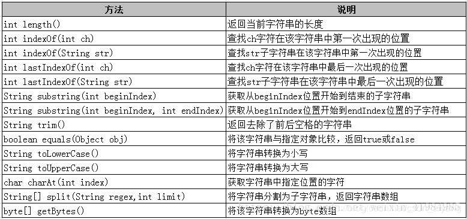

<!-- TOC -->

- [1. 导语(string 常用方法)](#1-导语string-常用方法)
- [2. 获取String 每个字符的方法](#2-获取string-每个字符的方法)
    - [2.1. s.charAt(i)](#21-scharati)
    - [2.2. s.subString(i,i+1)](#22-ssubstringii1)
    - [2.3. s.toCharArray(), c.size()](#23-stochararray-csize)

<!-- /TOC -->
# 1. 导语(string 常用方法)
对于字符串的操作，我们常用的就是trim()去除前后空格、subString()截取子字符串


# 2. 获取String 每个字符的方法

## 2.1. s.charAt(i) 
```JAVA
String s = "aaabbbbccccdddd";
List<String> list = new ArrayList<String>(); //定义对象依次存放每一个字符
  
for(int i = 0; i < str.length() ; i++){
  
  String ss = String.valueOf(str.charAt(i));
  
  list.add(ss);
}
  
System.out.println(list.toString());
```

## 2.2. s.subString(i,i+1)
```JAVA
String s = "aaabbbbccccdddd";
List<String> list = new ArrayList<String>(); //定义对象依次存放每一个字符
  
for(int i = 0; i < str.length() ; i++){
  
  String ss = String.subString(i,i+1);
  
  list.add(ss);
}
System.out.println(list.toString());
```
## 2.3. s.toCharArray(), c.size() 
```JAVA
String s = "aaabbbbccccdddd";
List<String> list = new ArrayList<String>(); //定义对象依次存放每一个字符
  
for(int i = 0; i < str.length() ; i++){
  
  String ss = String.subString(i,i+1);
  
  list.add(ss);
}
System.out.println(list.toString());
```