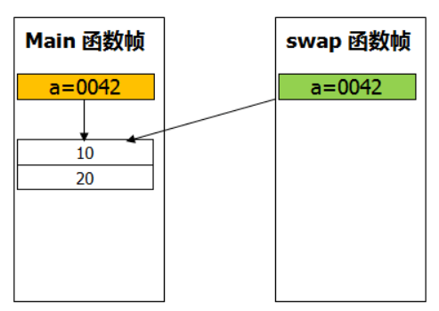
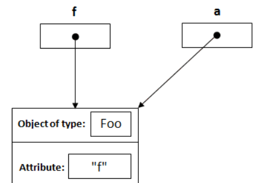

**数组、类、接口按值传递的时候都是传递对象的地址。**
```JAVA
public static void main(String[] args) {    
        int []a={10,20};
        System.out.println("a[0] :"a[0]+"a[1] : "+a[1]);//a[0]=10,a[1]=20;      
        swap(a, 0, 1);
        System.out.println("a[0] :"a[0]+"a[1] : "+a[1]);//a[0]=20,a[1]=10;  

    }
public static void swap(int []a,int i,int j){
        int temp=a[i];
        a[i]=a[j];
        a[j]=temp;
        System.out.println("a[0] :"a[0]+"a[1] : "+a[1]);//a[0]=20,a[1]=10;
    }
//输出
/*a[0]=10 a[1]=20

  a[0]=20 a[1]=10

  a[0]=20 a[1]=10   
*/
```




```JAVA
public class Main{
     public static void main(String[] args){
          Foo f = new Foo("f");
          changeReference(f); // It won't change the reference!
          modifyReference(f); // It will modify the object that the reference variable "f" refers to!
     }
     public static void changeReference(Foo a){
          Foo b = new Foo("b");
          a = b;
     }
     public static void modifyReference(Foo c){
          c.setAttribute("c");
     }
}
```
**changerefernce(f)**


String 类值不可改

StringBuffer 可以

https://blog.csdn.net/u013309870/article/details/75499175
