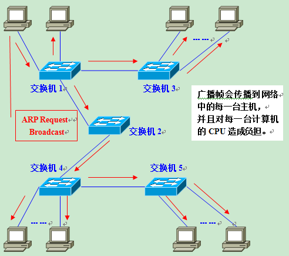
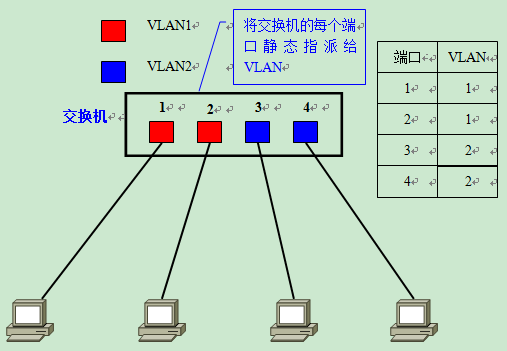
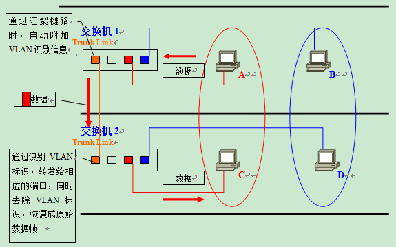
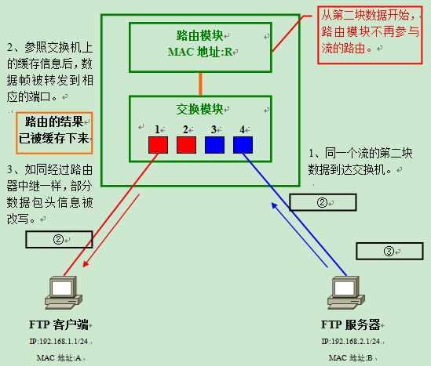
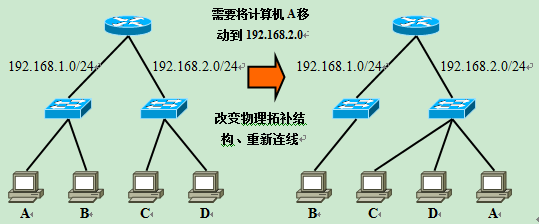
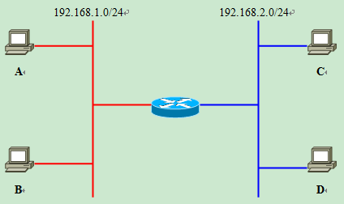

 **原文** 
>https://blog.csdn.net/zjkc050818/article/details/80663886

# 为什么需要VLAN

## 什么是VLAN
用路由分割的 网络（广播域）

## 非分割广播域时
原网络

当A 与 B通信 交换机会转发到其他端口 **Flooding**

这导致了网络带宽和CPU运算能力无谓消耗

## 常用广播通信

* ARP请求
* RIP 
* DHCP 
* NetBEUI：Windows下使用的网络协议
* IPX：NovellNetware使用的网络协议
* Apple Talk：苹果公司的Macintosh计算机使用的网络协议。

## 广播域分割与VLAN必要性
* 分割广播域，一般用路由的LAN interface 
但是，通常情况下路由器无太多网络接口 而且有的lan口其实有可能是路由内置的交换机

* 与路由器相比，二层交换机一般带有多个网络接口。因此如果能使用它分割广播域，那么无疑运用上的灵活性会大大提高。

* 二层交换机上分割广播域的技术，就是VLAN。通过利用VLAN，我们可以自由设计广播域的构成，提高网络设计的自由度。

# VLAN 机制
## VLAN id

## 直观描述

但是虽然连在同一个交换机 不同VLAN 不能直接通信

## VLAN通信

VLAN是广播域。而通常两个广播域之间来往的数据包都是由路由器中继的。因此，$\color{#FF3030}{VLAN间的通信也需要路由器提供中继服务，这被称作“VLAN间路由”。}$

# 端口访问方式 
    分为访问链接和汇聚链接
## VLAN访问链接
只属于一个VLAN 端口转发数据帧
### 静态VLAN-基于端口

很难频繁修改

### 动态VLAN 
根据端口连的计算机
* 根据MAC的VLAN
* 根据子网的VLAN
* 根据用户的VLAN

差异：$\color{#3030ff}{根据OSI参照模型哪一层的信息决定端口所属的VLAN。}$

#### 根据MAC的VLAN

OSI二层访问链接方法 更换网卡要改设定

#### 基于子网的VLAN

OSI三层访问链接方法 比较灵活

#### 基于用户的VLAN
根据当前登录用户  OSI四层以上

## 汇聚链接

### 需要设置跨越多台交换机VLAN （同一部门不同楼层）

**简单方法** 添加口互连 端口效率比较低 

### 汇聚链接 （用一个口互连）
$\color{#3030ff}{汇聚链接（Trunk Link）指的是能够转发多个不同VLAN的通信的端口。}$
汇聚链路上流通的数据帧，都被附加了用于识别分属于哪个VLAN的特殊信息。

#### 汇聚方式
##### IEEE 802.1Q

##### ISL
Cisco产品支持的

# VLAN间路由
## VLAN间路由必要性
因为收不到ARP（广播） 不同VLAN无法直接通信

## 使用路由器VLAN间路由
$\color{#3030ff}{简单方法}$

扩展性问题增加一个VLAN 路由要多一个LAN口

$\color{#3030ff}{汇聚链接}$
路由器上定义各个VLAN的子接口

## 同一VLAN通信
网络

**ABCDR 为MAC地址** **原网络**

$\color{#3030ff}{A到B通信在交换机内完成}$

## 不同VLAN 间通信

知道不是一个网段，就向默认网关转发，ARP获取路由MAC
$\color{#ff3030}{进行VLAN间通信时，即使通信双方都连接在同一台交换机上，也必须经过：“发送方——交换机——路由器——交换机——接收方”这样一个流程。}$

# 三层交换机
## 路由器 来进行VLAN间路由问题
$\color{#ff3030}{随着VLAN之间流量的不断增加，很可能导致路由器成为整个网络的瓶颈。}$
* 交换机ASIC，专用硬件处理数据帧，很多能达到wired Speed 
* 路由器 软件处理不能不限速转发

## 三层交换机 
$\color{#ff3030}{本质上带有 路由（第三层功能）的交换机，使用ASIC硬件处理路由，高速路由}$

### 三层交换机同一VLAN通信

### 三层交换机不同一VLAN通信

$\color{#ff3030}{都需要经过“发送方→交换模块→路由模块→交换模块→接收方”}$

# 加速VLAN通信手段

## 流（flow）
如FTP传输较大文件 MTU（Maximum Transmission Unit）限制 会分割小块
$\color{#3030ff}{只要将流最初的数据正确地路由以后，后继的数据理应也会被同样地路由。据此，后继的数据不再需要路由器进行路由处理；通过省略反复进行的路由操作，可以进一步提高VLAN间路由的速度。}$

## 加速VLAN间路由的机制

$\color{#ff3030}{第一块数据路由结果记录到缓存保存}$
1. 目标IP地址

2. 源IP地址

3. 目标TCP/UDP端口号

4. 源TCP/UDP端口号

5. 接收端口号（交换机）

6. 转发端口号（交换机）

7. 转发目标MAC地址
等等

# 传统路由器存在意义

## 传统路由器必要性
三层交换机很贵 
* 用于与WAN链接
三层交换机一般只有LAN
* 保证网络安全
路由器网络安全功能多，除了三层也有的数据报过滤，还有基于IPSec构建VPN（VirtualPrivate Network）、利用RADIUS进行用户认证等等。
* 支持除TCP/IP以外的异构网络结构
除了高端三层一般三层交换只支持TCP/IP

## 传统路由器和交换机配合构建LAN 实例
各楼层配置二层定义VLAN 楼层间用三层交换高速
与WAN的连接，则通过带有各种网络接口的路由器进行。并且，通过路由器的数据包过滤和VPN等功能实现网络安全。

# 使用VLAN设计局域网
## 使用VLAN设计局域网特点
* 不收物理链路现在自由分割广播域，能够适应灵活多变的网络构成。
* 但是，由于利用VLAN容易导致网络构成复杂化，因此也会造成整个网络的组成难以把握。
## 不使用VLAN的局域网中网络构成的改变

图中的路由器，带有2个LAN接口。左侧的网络是192.168.1.0/24，右侧是192.168.2.0/24。

现在如果想将192.168.1.0/24这个网络上的计算机A转移到192.168.2.0/24上去，就需要改变物理连接、将A接到右侧的交换机上。

并且，当需要新增一个地址为192.168.3.0/24的网络时，还要在路由器上再占用一个LAN接口并添置一台交换机。而由于这台路由器上只带了2个LAN接口，因此为了新增网络还必须将路由器升级为带有3个以上LAN接口的产品。

## 使用VLAN局域网中网络构成的改变
只要在交换机上生成蓝色VLAN，然后将计算机A所连的端口1加入到蓝色VLAN中去，使它成为访问链接即可。$\color{#ff3030}{ip如果是DHCP获取 那都不需要对客户机任何改变}$ 

经常需要改变网络布局 VLAN优势明显

## 利用VLAN而导致的网络结构复杂化
由于数据流纵横交错，一旦发生故障时，准确定位并排除故障会比较困难。

## 把握网络的逻辑结构与物理结构

$\color{#ff3030}{物理结构}$ 

$\color{#3030ff}{当进行路由和数据包过滤的时候，需要逻辑结构}$ 

