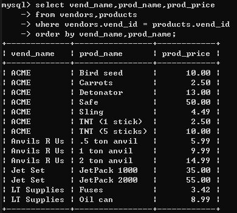
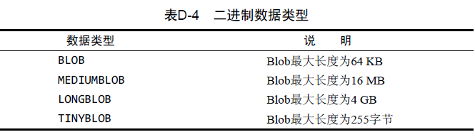

# 了解SQL
## 数据库
* 表
* 列和数据类型
* 行
* **主键**
每行（列）一个主键不相同

## SQL（Structured Query Language）


# 了解MYSQL

DBMS 数据库管理系统 两种

* 共享文件系统 
    用的少 低端
* 客户机 服务器

## MYSQL
* 开源
* 快
* 简单
安装：
 > https://www.runoob.com/mysql/mysql-install.html
### CS程序

客户机应用
* 命令行
* MYSQL administrator 服务器管理
* MYSQL Query Browser 执行命令


# 使用MYSQL
## 连接
```sql
 mysql -u root -p
```

**以下命令要不就全大写或者全小写**
## 创建 导入数据库
```sql
create database xxx
use xxx
source d:\test.sql
```


## 使用某数据库
```sql
use database;
```
## 数据库列表
```sql
show databases;
```
## 数据中的表
```sql
show tables;
```
## 数据表的属性，属性类型，主键信息 
```sql
show columns from xxxx;
```


## 数据表的索引信息
```sql
show index from xxxx;
```


## 数据表的性能信息
```sql
 show table status from mysql like 'user%';
```


# 检索数据

## 检索单个列 检查多个列 所有列

**无序**
```sql
select xxx from xxxx;
select xxx，xx,xxx from xxxx;
select * from xxx;
```

## 检索出不同的行 DISTINCT

```sql
select distinct vend_id from products;
```
本来有14行


## 限制结果 LIMIT
从第4行开始5个
```sql
select  vend_id from products limit 5,4;
```

## 完全限定

```sql
select  products.prod_name from crashcourse.products limit 5,4;
```

# 排序检索

## 单行排序
实际上可以用**别的列**按字母排序 
```sql
select  prod_name
from products 
order by prod_name 
```

## 多行 多规则排序
检索三个列，按其中两个列排序 首先价格（价格相同的情况） 在按名称
```sql
select  prod_id,prod_price,prod_name
from products 
order by prod_price,prod_name 
```


## 降序 DESC
```sql
select  prod_id,prod_price,prod_name
from products 
order by prod_price desc,prod_name 
```

## 找最贵
```sql
select  prod_id,prod_price,prod_name
from products 
order by prod_price desc
limit 1;
```

# 过滤数据

## where
order by 需要在whre 后
```sql
select  prod_id,prod_price,prod_name
from products 
where prod_price=2.50
```


### 空值检测
空值和0值、空字符、空格不一样 
```sql
select  prod_id,prod_price,prod_name
from products 
where prod_price is null
```

## and or 
```sql
select  prod_id,prod_price,prod_name
from products 
where (vend_id = 1002 or vend_id = 1003) and prod_price>=10
```

## in (清晰的or) 执行更快
```sql
select  prod_id,prod_price,prod_name
from products 
where (vend_id in (1002,1003)) and prod_price>=10
```

## not 不在后续的条件
```sql
select  prod_id,prod_price,prod_name
from products 
where (vend_id not in (1002,1003)) and prod_price>=10
```


# 通配符过滤

## like
 
**%** 代表任意字符

```sql
select  prod_id,prod_price,prod_name
from products 
where prod_name like 'jet%'
where prod_name like '%jet%' 含有 jet
```

**_** 代表单个字符


# 正则表达式
很复杂 只讲一些
## REGEXP 代表后面是正则表达
**默认不区分大小写**
除了加上binary 
```sql
where prod_name regexp binary 'JetPACK .000'; 
```
**.**代表任意一个字符
```sql
select  prod_id,prod_price,prod_name
from products 
where prod_name regexp '1000'; 匹配1000的
where prod_name regexp '.000'; 匹配x000的
```


### like 和 regexp 区别 （对于同样能执行的语句）
* like是对整个列查找 
* regexp 是对列的具体里面值 查找看含有没有 ，但是regexp可以通过别的符号来实现对整个列匹配

 

## | 表示or

## []代表组合
```sql
select  prod_id,prod_price,prod_name
from products 
where prod_name regexp '[123] Ton'; 将含有匹配'1 ton'or '2 ton''3 ton'的匹配
where prod_name regexp '[1-3] Ton'; 将含有匹配'1 ton'or '2 ton''3 ton'的匹配
```

与|的不同
```sql
select  prod_id,prod_price,prod_name
from products 
where prod_name regexp '1|2|3 Ton';将含有 '1' or '2' or '3' ton 匹配
```


## 匹配特殊字符 就是% . -

```sql
select  prod_id,prod_price,prod_name
from products 
where prod_name regexp '\\.';将含有.的匹配
```
引用元字符
 
 

## 匹配多个实例 （多次 或几次）

 

**?** 代表前面一个字符出现0 或者1次

```sql
select  prod_id,prod_price,prod_name
from products 
where prod_name regexp '\\([0-9] sticks?\\)'
order by prod_name;
```
 

**{4}** 

```sql
select  prod_id,prod_price,prod_name
from products 
where prod_name regexp '[[:digit:]]{4}'
order by prod_name;
```
匹配四个数字

## 定位符
 

```sql
select  prod_id,prod_price,prod_name
from products 
where prod_name regexp '^[[:digit:]\\.]'
order by prod_name;
```

 


可以用select 测试 正则
```sql
select 'hello' regexp '^[[:digit:]\\.]'
```
会返回0


# 创建计算字段

数据表的数据用到的一般不是应用程序需要的格式


字段（field） 基本和列一样 在计算字段用到

**为什么不在应用程序处理呢** 
因为DBMS快得多

## concat 拼接
```sql
select concat(vend_name,'(',vend_country,')')
from vendors
order by vend_name;
```
 


## trim Ltrim Rtrim 去左右空格 去左 去右
```sql
select concat(Rtrim(vend_name),'(',Rtrim(vend_country),')')
from vendors
order by vend_name;
```

## 导出列 别名 AS
之前只是看 
```sql
select concat(Rtrim(vend_name),'(',Rtrim(vend_country),')')
as vend_title
from vendors
order by vend_name;
```

## 计算 +-*/

```sql
select prod_id,quantity,item_price,
       quantity*item_price as expand_price //取名字不同会自动覆盖字段
from orderitems
where order_num=20005;
```

# 数据处理函数

## 文本处理
 
 

其中Soundex() 是匹配发音的
```sql
select cust_name,cust_contact
from customers
where soundex(cust_contact)=soundex('Y lie');
```
 

## 日期时间处理
日期格式 最好 xxxx-xx-xx
 

如果要日期 用Data（）
如果要时间 用Time()
他们会从列出提取 就算只有一个
```sql
select cust_id,order_num
from orders
where soundex(cust_contact)=soundex('Y lie');
```

## 数值处理
 

# 汇总数据

经常需要汇总数据而不用实际检索(会浪费时间)
 

## 常用函数
### AVG()
```sql
select AVG(prod_price) as avg_price
from products;
```

### COUNT()

count(*) 计算所有行数 包括空
```sql
select count(*) as cust_num
from customers;
```
count(cust_mail) 计算列中非null的数量

```sql
select count(cust_mail)  as cust_num
from customers;
```

### MAX()
对于数值和时间返回最大的 
```sql
select max(prod_price) as max_price
from products;
```


对于别的数据就返回最后一行
```sql
select max(prod_name) as max_prod_name
from products;
```

### MIN（）与上同

### SUM()


## 聚集不同值
可用于上述函数
### distinct 

只考虑不同值 
```sql
select AVG(distinct prod_price) as avg_price
from products;
```


# 数据分组
在汇总数据的基础上 想知道每个供应商对应的
```sql
select vend_id,count(*) as num_pords
from products
```
这样就失败，没有得到我们想要的
   


## group by
```sql
select vend_id,count(*) as num_pords
from products
group by vend_id;
```
 


## 过滤分组（注意此时不能where where 是决定什么行不要)

### having
```sql
select vend_id,count(*) as num_pords
from products
group by vend_id
having count(*)>2;
```

 

## 分组排序


### order by
order by 与 group by的区别
 

第一点很重要
应该提供明确的order by 决定分组顺序

```sql
select order_num,sum(quantity*item_price) as order_total
from orderitems
group by order_num
having order_total>50
order by order_total;
```
无order by


you order by


### select 顺序


# 子查询
想要查询所有订购了'TNT2'的用户id 但是 他们之间没有直接的表

只能先查 数量
```sql
select order_num
from orderitems
where prod_id='TNT2';
```

在通过数量查询用户id
```sql
select cust_id
from orders
where order_num in (20005,20007);
```


## 子查询过滤

嵌套查询 出客户的id 
```sql
select cust_id
from orders
where order_num in (select order_num
                    from orderitems
                    where prod_id='TNT2');
```

在继续查询出客户的信息
```sql
select cust_name,cust_contact
from customers
where cust_id in (
                  select cust_id
                  from orders
                  where order_num in (
                                      select order_num
                                      from orderitems
                                      where prod_id='TNT2');

```


## 计算子查询

1.检查 customersl里面的客户列表 
2.对于每个客户计算在orders里面的订单数

```sql
select cust_id
from customers;
```


只能单独算 
```sql
select count(*) as orders
from orders
where cust_id = 10001;
```

```sql
select cust_name,cust_state,cust_id,
       (select count(*) as orders
        from orders
        where orders.cust_id=customers.cust_id) as orders
from customers
order by cust_name;
```

如果cust_id = cust_id 会导致歧义


# 联结表


假如有一个包含产品目录的数据库列表，每种类别一行
对于每种物品存储的信息包括产品描述、价格、供应商等。

如果需要保存同一个供应商生成的多个产品？

为什么要分开存储数据和产品信息？

* 防止重复
* 信息更改只要一次
* 如果每个产品都存供应商信息，不能保证数据一致性
* 相同数据出现多次不是好事


建立关系表 一个是产品信息 一个是供应商信息

* 供应商信息 每个供应商存着信息 有着唯一的标识 就是主键（primary key)

* 产品信息 只存产品信息 加上供应商信息primary key 也就是对于products 来说的外键


这样的好处
* 供应商信息不重复
* 供应商信息改变只要改供应商表
* 数据无重复且一致


## 为什么联结
联结是一种机制，更好处理
要保证外键存在


## 创建联结
```sql
select vend_name,prod_name,prod_price
from vendors,products
where vendors.vend_id = products.vend_id
order by vend_name,prod_name;
```



同样的
```sql
select vend_name,prod_name,prod_price
from vendors inner join products
on vendors.vend_id = products.vend_id
order by vend_name,prod_name;
```

## 多联结
可以先列出所有的表 在决定关系
```sql
select vend_name,prod_name,prod_price,quantity
from orderitems,products,vendors
where vendors.vend_id = products.vend_id
and orderitems.prod_id=products.prod_id
and order_num=20005
order by vend_name,prod_name;
```

```sql
select vend_name,prod_name,prod_price,quantity
from orderitems,products,vendors
where vendors.vend_id = products.vend_id
and orderitems.prod_id=products.prod_id
and order_num=20005
order by vend_name,prod_name;
```


实现14章子查询
```sql
select cust_name,cust_contact
from customers,orders,orderitems
where customers.cust_id=orders.cust_id
and orders.order_num=orderitems.order_num
and prod_id='TNT2';
```


# 高级联结

## 表别名
```sql
select cust_name,cust_contact
from customers as c,orders as o,orderitems as oi
where c.cust_id=o.cust_id
and o.order_num=oi.order_num
and prod_id='TNT2';
```

## 自联结
发现某物品有问题 查该物品的供应商的其他物品是否有问题
找该供应商生成的其他产品

子查询
```sql
select prod_id,prod_name
from products
where vend_id= (select vend_id
                from products
                where prod_id='DTNTR');
```

自联结
```sql
select c.*,o.order_num,o.order_date,
       oi.prod_id,oi.quantity,oi.item_price
from customers as c,orders as o,orderitems as oi
where c.cust_id =o.cust_id
and oi.order_num =o.order_num
and oi.prod_id='FB';
```


## 自然联结
重复的列不会列出来

```sql
select p1.prod_id,p1.prod_name
from products as p1,products as p2
where p1.vend_id=p2.vend_id
and p2.prod_id='DTNTR';
```


## 外部联结

没有关联行的行 外部联行

目标：
* 对每个客户下多少订单计数 包括没人订购的
* 列出所有产品 包括没人订购的
* 平均规模，包括未下单的

内联
```sql
select customers.cust_id,orders.order_num
from customers inner join orders
on customers.cust_id = orders.cust_id;
```

外左联

```sql
select customers.cust_id,orders.order_num
from customers left outer join orders
on customers.cust_id = orders.cust_id;
```

外右联
```sql
select customers.cust_id,orders.order_num
from customers right outer join orders
on customers.cust_id = orders.cust_id;
```


# 组合查询

相当于输出两个查询的结果 连接起来
## UNION
```sql
select vend_id,prod_id,prod_price
from products
where prod_price <=5
union
select vend_id,prod_id,prod_price
from products
where vend_id in (1001,1002);
```


**注意点**:查询的东西一样


## UION ALL

```sql
select vend_id,prod_id,prod_price
from products
where prod_price <=5
union all
select vend_id,prod_id,prod_price
from products
where vend_id in (1001,1002);
```


# 全文本搜索

有几种数据库引擎
常见有MyISAM 支持  InnoDB不支持
```sql
create table productnotes
(
    note_id     int         not null AUTO_INCREMENT,
    prod_id     char(10)    not null,
    note_date   datetime    not null,
    note_text   text        null,
    primary key(note_id),
    fulltext(note_text)
)engine=MyISAM;
```

定义了表并列出它包含的列
根据fulltext(note_text) 指示来对它索引  
也可索引多个列

**tips** 不要在导入数据时 使用fulltext ,应该先导入数据到新表
在修改表定义

## Match() against()

match 某列 against 关键词
```sql
select note_text
from productnotes
where match(note_text) against('rabbit');
```


简单搜索和like差不多
```sql
select note_text
from productnotes
where note_text like '%rabbit%';
```


**重要** : 可以对结果排序
```sql
select note_text,
        match(note_text) against('rabbit') as rank1
from productnotes;
```
根据匹配词的数目 唯一词的数目 包含行的行数 对结果排序


## 查询扩展

* 先全文本搜索出 相关行
* 在相关行中检测出有用词（MYSQL断定的）
* 根据这些有用词在查询

```sql
select note_text
from productnotes
where match(note_text) against('anvils' with query expansion);
```


## 布尔文本搜索

* 要匹配的词
* 要排斥的词
* 排列提示 （哪些词更重要)

**没有FULLTEXT索引也可以用**布尔方式，但是很慢
```sql
select note_text
from productnotes
where match(note_text) against('heavy' in boolean mode);
```

排斥任意以rope开始的行
```sql
select note_text
from productnotes
where match(note_text) against('heavy -rope*' in boolean mode);
```


**操作表**


**例子**
搜索包含rabbit **和**bait的行
```sql
select note_text
from productnotes
where match(note_text) against('+rabbit +bait' in boolean mode;
```
搜索包含rabbit或者bait **至少一个的行**
```sql
select note_text
from productnotes
where match(note_text) against('rabbit bait' in boolean mode;
```
搜索包含 **rabbit bait的短语**
```sql
select note_text
from productnotes
where match(note_text) against('+rabbit +bait' in boolean mode;
```

搜索包含rabbit或者bait **至少一个的行** 增加前者的登记
```sql
select note_text
from productnotes
where match(note_text) against('+rabbit +bait' in boolean mode;
```


# 数据插入

## 插入完整的行

```sql
insert into customers
values(null,
        'Pep E.LaPew',
        '100 Main Street',
        'Log Angeles',
        'CA',
        '90046',
        'USA',
        null,
        null);
```
简单但不使用 因为依赖次序


```sql
insert into customers(cust_name,
        cust_address,
        cust_city,
        cust_state,
        cust_zip,
        cust_country,
        cust_contact,
        cust_email)
values(null,
        'Pep E.LaPew',
        '100 Main Street',
        'Log Angeles',
        'CA',
        '90046',
        'USA',
        null,
        null);
```
这样表结构变了 依然能使用

**提高性能**
可以在insert 和into 直接添加 low_priority 降低优先级来先处理优先级高的

## 插入多行

**1方式**

```sql
insert into customers(cust_name,
        cust_address,
        cust_city,
        cust_state,
        cust_zip,
        cust_country,
        cust_contact,
        cust_email)
values(null,
        'Pep E.LaPew',
        '100 Main Street',
        'Log Angeles',
        'CA',
        '90046',
        'USA',
        null,
        null);
insert into customers(cust_name,
        cust_address,
        cust_city,
        cust_state,
        cust_zip,
        cust_country,
        cust_contact,
        cust_email)
values(null,
        'Pe2p E.LaPew',
        '1002 Main Street',
        'Log2 Angeles',
        'CA2',
        '900462',
        'USA2',
        null,
        null);
```

**2方式**
效率高 相当于单insert
```sql
insert into customers(cust_name,
        cust_address,
        cust_city,
        cust_state,
        cust_zip,
        cust_country,
        cust_contact,
        cust_email)
values(null,
        'Pep E.LaPew',
        '100 Main Street',
        'Log Angeles',
        'CA',
        '90046',
        'USA',
        null,
        null)，
values(null,
        'Pe2p E.LaPew',
        '1002 Main Street',
        'Log2 Angeles',
        'CA2',
        '900462',
        'USA2',
        null,
        null);
```

## 插入检索数据
```sql
insert into customers(cust_name,
        cust_address,
        cust_city,
        cust_state,
        cust_zip,
        cust_country,
        cust_contact,
        cust_email)
select cust_name,
        cust_address,
        cust_city,
        cust_state,
        cust_zip,
        cust_country,
        cust_contact,
        cust_email
from custnew;
```
**注意** 不一定要名称一样


# 创建表

* 页面创建
* 语句创建

## 创建基础

### **MYSQL 忽略空格**
以cust_id 为主键

### **使用null** 
创建的时候不允许null not null在插入时不允许null值
null 和 空 不一定

### AUTO_INCREMENT
每增加一行 自动增 也可以给一个值只要是唯一的
select last_insert_id() 可以获得


### default 值

### 引擎类型

* InnoDB 是可靠的事务处理 不支持全文搜索

* MEMROY 功能等于MyISAM 数据存在内存，速度很快

* MyISAM 性能极高 支持全文本搜索 不支持事务处理


## 更新表


### alter 
* 添加列
```sql
alter table vendors
add vend_phone char(20);
```
* 删除列

```sql
alter table vendors
drop columns vend_phone;
```

* 加外键
```sql
alter table orderitems
add consraint fk_orderitems_orders
foreign key (order_num) references orders (order_num);
```


* 复杂表结构更改一般需要手动删除
    * 新布局建表
    * insert select导入旧表数据
    * 检验新表
    * 重命名旧表
    * 重命名新表
    * 根据需要 重新创建触发器 存储过程 索引 外键


## 删除表

没确认 不撤销
```sql
drop table custmers2;
```

## 重命名新表
```sql
rename table custmers2 to customers;
```

# 视图

## 视图
15章的
```sql
select cust_name,cust_contact
from customers,orders,orderitems
where customers.cust_id=orders.cust_id
and orders.order_num=orderitems.order_num
and prod_id='TNT2';
```
整个查询包装成一个名为 productscustomers 虚拟表

```sql
select cust_name,cust_contact
from productscustomers
where prod_id='TNT2';
```
作为视图不应该有任何列或数据 包含SQL查询

### 视图作用

* 重用SQL语句
* 保护表
* 使用表的组成部分而不是整个表
* 可更改数据格式

视图可使用和表基本相同的方式

**视图不包含数据，大量视图可能导致性能问题**

### 视图规则


## 使用视图

### 简化复杂联结
```sql
create view productscustomers as
select cust_name,cust_contact,prod_id
from customers,orders,orderitems
where customers.cust_id=orders.cust_id
and orders.order_num=orderitems.order_num
```

创建了productcustomers视图 联结了三个表

### 视图格式化检索数据
### 过滤不想要的数据

### 应该视图用于检索 不更新


# 存储过程
为以后的使用保存一条或者多条MySQL的语句

## 为什么使用存储过程
* 封装
* 保证开发人员和应用程序一个存储过程
* 简化对变动的管理
* 安全性
* 提高性能
## 使用存储过程

### 执行存储过程
```sql
call productpricing(@pricelow,
                    @pricehigh,
                    @priceaverage
                        );
```

### 创建存储过程
```sql
create procedure productpricing()
begin
        select avg(prod_price) as priceaverage
        from products;
end;
```
如果是命令行
因为Mysql 默认分隔符是; 向上面那样创建会报错
**解决方法**
通过delimiter 更改
```sql
delimiter //
create procedure productpricing()
begin
        select avg(prod_price) as priceaverage
        from products;
end //

delimiter ;
```

### 删除存储过程
```sql
drop procedure productpricing()
```

### 使用参数的存储过程


```sql
delimiter //
create procedure productpricing(
        out pl decimal(8,2),
        out ph decimal(8,2),
        out pa decimal(8,2)
)
begin
        select min(prod_price)
        into pl
        from products;
        select max(prod_price)
        into ph
        from products;
        select avg(prod_price)
        into pa
        from products;
end //
delimiter ;
```

调用
```sql
call productpricing(@pricelow,
                    @pricehigh,
                    @priceaverage
                        );
```


带输入输出参数的
```sql
delimiter //
create procedure ordertotal(
        in onnumber int,
        out ototal decimal(8,2)
)
begin
        select sum(item_price*quantity)
        from orderitems
        where order_num = onnumber
        into ototal;
end //
delimiter ;
```

```sql
delimiter //
create procedure ordertotal(
        in onnumber int,
        out ototal decimal(8,2)
)
begin
        select sum(item_price*quantity)
        from orderitems
        where order_num = onnumber
        into ototal;
end //
delimiter ;
```


```sql
call ordertotal(20009,@total);
select @total;
```

### 建立智能存储过程
* 获得总计
* 把营业税 有条件添加
* 返回合计（带税或者不带）

```sql
delimiter //
-- Name : ordertotal
-- Parameters : onnumber = order_num
--              taxable = 0 if not taxalbe, 1 if taxalbe
--              ototal = 0 order total variable

create procedure ordertotal(
        in onnumber int,
        in taxable boolean,
        out ototal decimal(8,2)
) comment 'Obtain order total,optionally adding tax'
begin
        -- Declare variable for total
        declare total decimal(8,2);
        -- Declare tax percentage
        declare taxrate int default 6;

        -- get the order total
        select sum(item_price*quantity)
        from orderitems
        where order_num = onnumber
        into total;

        -- Is this taxalbe?
        if taxable then
                -- yes add tax rate to total
                select total+(total/100*taxable) into total;
        end if;
        -- finally save 
        select total into ototal;
end //
delimiter ;
```

```sql
call ordertotal(20005,0,@total);
select @total;
call ordertotal(20005,1,@total);
select @total;
```


### 检查存储过程
```sql
show create procedure ordertotal
```

# 游标 
普通查询没办法得到 第一行 下一行 前10行 
游标存储在Mysql服务器的数据库查询 是检索出来的结果集 

## 使用游标cursor

* 使用前要定义 
* 使用完要关闭

### 创建游标

```sql
create procedure processorders()
begin
        declare ordernumbers cursor
        for
        select order_num from orders;
end;
```
上面定义了游标
存储过程处理完成后，游标就消失

### 打开关闭游标

```sql
create procedure processorders()
begin
        declare ordernumbers cursor
        for
        select order_num from orders;
        open ordernumbers;
        close ordernumbers;
end;
```

### 使用


```sql
create procedure processorders()
begin
        declare ordernumbers cursor
        
        select order_num from orders;
        open ordernumbers;
        fetch ordernumbers into o;
        close ordernumbers;
end;
```

fetch 检索当前行的order_num列 （自动从第一行开始）
到一个名为o的局部变量 


```sql
create procedure processorders()
begin
        declare done boolean default 0;
        declare o int;

        declare ordernumbers cursor

        for 
        select order_num from orders;
        declare continue handler for sqlstate '02000' set done=1;
        open ordernumbers;
                repeat
                        fetch ordernumbers into o;
                until done end repeat;
        close ordernumbers;
end;
```

反复执行到done 为真 此时是sqlstate '02000' 如果没找到就是所有行循环完

局部变量定义在游标之前 句柄在游标之后


**最终案例**
```sql
delimiter //
create procedure processorders()
begin
        declare done boolean default 0;
        declare o int;
        declare t decimal(8,2);


        declare ordernumbers cursor

        for 
        select order_num from orders;
        declare continue handler for sqlstate '02000' set done=1;
        create table if not exists ordertotals
                                   (order_num int,total decimal(8,2));
        open ordernumbers;
                repeat
                        fetch ordernumbers into o;
                        call ordertotal(o,1,t);
                        insert into ordertotals(order_num,total)
                        values(o,t);
                until done end repeat;
        close ordernumbers;
end//
```


# 触发器

## 触发器定义
想要某条语句在事件发生时自动执行
* 加个顾客，检查电话号码格式是否正确，州缩写是否大写
* 订购一个产品，从库存数量减去订购数量

只有三种语句支持在他们发生后触发
* delete
* insert
* update 

* **只支持表** 不支持临时表和视图
* 每个表最多6个

## 创建触发器
```sql
create trigger newproduct after insert on productcustomers
-- 现版本不支持for each row select 'Product added'
for each row select 'Product added' into @productinfo; 

```
## 删除触发器
```sql
drop trigger newproduct;
```

## 使用触发器

### insert 触发器

使用**new** 访问被插入的行

```sql
create trigger neworder after insert on orders
-- 现版本不支持for each row select new.order_num 
for each row select new.order_num into @new_order_num;
```
插入一个新订单到orders表里，mysql表会自动生成
order_num（由于auto_increment) 而触发器取得并返回他

测试
```sql
insert into orders(order_date,cust_id)
values(now(),10001);
select @new_order_num;
```


**还有before 用于数据检验**

### delete 触发器
使用**old** 访问被删除的行 只读

保存任意删除订单存档
```sql
create trigger neworder before delete on orders
for each row 
begin 
        insert into archive_orders(order_num,order_date,cust_id) 
        values(old.order_num,old.order_date,old.cust_id);
end;
```
如果订单不能存档 delete 会放弃


### update触发器
综合 insert 和delete
* old访问旧值 new访问心智
* 在before 之前 new运行更新 （更改update的数据）
* old 只读
```sql
create trigger neworder before update on orders
for each row set new.vend_state = upper(new.vend_state);
```

## 总结
* 需要权限 
* 用来保持数据一致
* 不支持call 得拷贝过程代码 过来


# 事务处理 
InnoDB支持 

## 事务处理定义
维护数据库的完整性，保证成批的Mysql操作要么完全执行，要么完全不执行
设计良好的数据库都是关联的
例：orders和orderitems两个表 orders 实际订单 orderitems 存储订购产品，两个表通过主键 互相关联

给系统添加订单过程
1.  检查有无对应客户 customers表 没有添加
2. 检索客户id
3. 添加一行到orders表 与客户ID关联
4. 检索orders 赋值的新订单ID
5. 对于每个订购物品在orderitems表添加一行 通过检索的ID与orders表关联
（产品ID与products表关联）

如果过程中发生了数据库故障（超出空间，安全限制，表锁）
阻止其中的过程就会出现 有订单无信息的情况


**事务管理添加**
1.  检查有无对应客户 customers表 没有添加
2. 提交客户信息
3. 检索客户id
4. 添加一行到orders表 
5. 如果在添加行orders表 出现故障，回退
6. 检索orders 赋值的新订单ID
7. 对于每个订购物品在orderitems表添加一行 
8. 如果添加新行到orderitems 出现故障，回退所有添加的orderitems行和orders行
9. 提交订单信息

**KEYWORDS**
* 事务 transaction 一组SQL语句
* 回退 rollback 撤销指定SQL语句过程
* 提交 commit 讲为存储的SQL语句写入数据库表
* 保留点 savepoint 事务处理的临时占位符 place-holder 可以对它发布回退（与回退整个事务处理不同）


## 控制事务

### rollback

```sql
select * from ordertotals;
start transaction;
delete from ordertotals;
select * from ordertotals;
rollback;
select * from ordertotals;
```
删了回退


### commit

一般Mysql语句都是直接针对数据库操作 是隐含提交
implicit commit 

事务处理里面不会隐含提交
```sql
start transaction;
delete from ordertotals where order_num = 20010;
delete from orders where order_num = 20010;
commit;
```
**commit 只在两条都成功的情况下提交**

### savepoint
```sql
savepoint delete1；
rollback to delete1;
```
* 保留点越多越好 自己意愿回退

### 更改默认提交行为
set autocommit=0 


# 全球化和本地化（多种语言字符集）
## 字符集校对顺序
多种语言 字符集
* 字符集 字母和符合集合
* 编码 字符集成员内部表示
* 校对 规定字符如何比较
例：校对APE apex Apple 的正确排序顺序 依赖是否区分大小写
也影响搜索，以及法文 德文排序


## 使用字符集 和校对顺序

```sql
show character set;
```


展示了可用字符集合默认校对

```sql
show collation;
```
展示可用校对 一个字符集有很多校对  很多校对两次 
一次区分大小写 （_cs) 一次不区分大小写（_ci)


默认的字符集和校对 系统管理

```sql
show variables like 'character%';
show variables like 'collation%';
```


### 创建表指定字符集校对
* 对整个表
```sql
create table mytable
(
        column1 int,
        column2 varchar(10)
)default character set hebrew
collate hebrew_general_ci;
```

* 对整个表和特定的列

```sql
create table mytable
(
        column1 int,
        column2 varchar(10),
        column3 varchar(10) character set latin1 collate
                                          latin1_general_ci
)default character set hebrew
collate hebrew_general_ci;
```

* 以创建表不同的校对顺序排序

```sql
select * from customers
order by lastname,fisrtname collate latin1_general_cs;
```
临时区分大小写


# 安全管理

## 访问控制

* 多数用户能读写 少数能创建删除
* 有些只能读 不能更新
* 允许添加 不允许删除
* 有用户处理用户账号权限
* 只能通过存储过程访问数据 不直接
* 登录地点限制

**防止无意错误**
**不要使用root** 

## 管理用户
```sql
use mysql;
select user from user;
```


### 创建用户
```sql
create user ben identified by 'p@$$w0rd';
select user from user;
```
indentified by 指定纯文本口令作为散列值加密，密码

```sql
rename user ben to beforta;
```


### 删除用户
```sql
drop user beforta;
```

### 设置访问权限
#### 查看访问权限

```sql
show grants for beforta;
```

权限 usage on *.* 代表根本没有任何权限

#### 赋值和撤销访问权限
每个grant 添加一个权限
```sql
grant select on crashcourse.* to beforta;
show grants for beforta;
```

```sql
revoke select on crashcourse.* from beforta;
show grants for beforta;
```

grand 和revoke 控制访问权限层次
* 整个服务器，使用grant all 和 revoke all
* 整个数据库 on database.*
* 特定表 on datebase.table
* 特定的列
* 特定的存储过程


**注意点：** 
* grant revoke 用户必须存在但是对象不一定
* 可以简化 grant select,insert on crashcourse.* to bforta;

#### 修改用户密码
```sql
set password for bforta =Password('n3w p@$$w0rd');

```

# 数据库维护
 
## 备份数据

* mysqldump  转储数据库到外部
* mysqlhotcopy 从一个数据库复制所有数据
* backup table 或者select into outfile 到外部文件 
 用restore table 复原


 ## 进行数据库维护

查看表键 对不对
 ```sql
analyze table orders;
```

发现修复问题
 ```sql
check table orders,orderitems;
```

删除大量数据后用回收空间
 ```sql
optimize table orders,orderitems;
```


## 诊断启动问题
大多是自动启动 
mysqld 手动启动
 * --help 显示帮助
 * --safe-mode 装载 减去某些最近配置服务器
 * --verbose 显示全文本消息
 * --version 

## 查看日志

* 错误日志 hostname.err data目录
* 查询日志 所有活动hostname.log 
* 二进制日志 更新过数据的所有语句 hostname-bin
* 缓慢查询日志 记录执行缓慢的任何查询来优化


# 改善性能
> http://dev.mysql.com/doc/ Mysql文档

**TIPS**
* 所有DBMS有特定硬件建议
* 开始是默认设置，一段时间可能需要调整内存分配。
缓存区大小 （当前设置 show variables 和show status)。
* MYSQL多用户多线程的，一个执行慢，大家都满。 show processlit显示活动进程。 kill 终结。
* 总是有不只一种方法编写select，  联结子查询。
* explain， 解释如何执行一个select 。
* 存储过程比一条一条快。
* 绝不检索比需求多。
* 有操作支持delayed ，将控制返回调用程序 ，一有可能再执行。
* 导入数据， 应该关闭自动提交， 你可能删除索引， 包括fulltext索引
导入完在重建。
* 必须索引数据库表改善数据检索性能，可需要分析使用的select以找出重复的where 和order by 。如果一个简单的where子句 返回结果所花时间太长，可以断定其中使用的列需要索引
* 一个select 有一系列or 吗？ 通过多条和UNION语句，极大改善性能。
* 索引改善检索性能，损害数据插入、删除、更新性能。（索引可根据需要添加删除）
* like很慢。一般用fulltext 而不是like
* 数据库不断变化，理想配置也是
* **重要的是每条规则在某些条件会被打破**


# 数据结构
串字符


数值类型


日期时间


二进制
