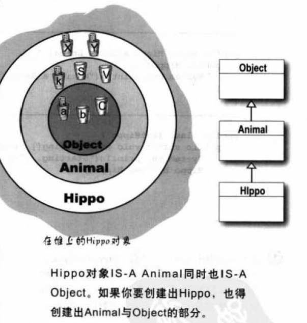
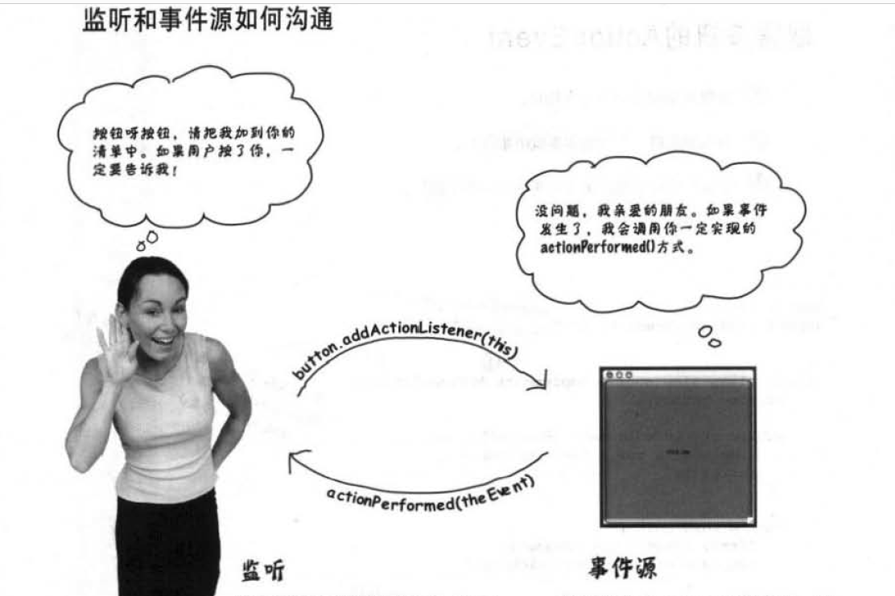
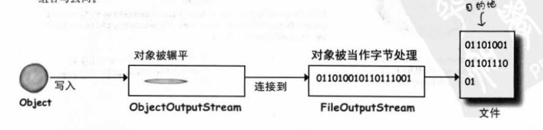

<!-- TOC -->

- [base](#base)
    - [对象引用问题](#对象引用问题)
    - [数组是一个对象](#数组是一个对象)
    - [类型转化 小到大  大到小需要显示指派](#类型转化-小到大--大到小需要显示指派)
    - [实例变量有默认值 （类里）  局部变量没有默认值 直接使用报错](#实例变量有默认值-类里--局部变量没有默认值-直接使用报错)
    - [== 只是比较里面的字节](#-只是比较里面的字节)
    - [ArrayList 里面放的是对象  如果是主数据类型 会被包装成object](#arraylist-里面放的是对象--如果是主数据类型-会被包装成object)
- [多态 1 继承](#多态-1-继承)
    - [变量编译看左边 执行也看左边 方法编译看左边 执行看右边](#变量编译看左边-执行也看左边-方法编译看左边-执行看右边)
    - [子类想要引用父类的方法加上一些](#子类想要引用父类的方法加上一些)
    - [运用事态时，引用英型可以是实际对象类型的父类（多态）](#运用事态时引用英型可以是实际对象类型的父类多态)
    - [无法看到源码 又想修改方法 可以继承来做](#无法看到源码-又想修改方法-可以继承来做)
    - [final 标记方法防止覆盖](#final-标记方法防止覆盖)
    - [参数一样 返回类型兼容 不降低读取权限](#参数一样-返回类型兼容-不降低读取权限)
- [重载](#重载)
- [多态 2 接口与抽象类](#多态-2-接口与抽象类)
    - [抽象类  不能让animals new 出来 （不知道什么动物是动物）](#抽象类--不能让animals-new-出来-不知道什么动物是动物)
- [所有类继承了Object](#所有类继承了object)
    - [可以覆盖部分方法，但是部分是final(强烈建议覆盖hashcode equals toString)](#可以覆盖部分方法但是部分是final强烈建议覆盖hashcode-equals-tostring)
    - [不可把所有返回和参数设置成Object](#不可把所有返回和参数设置成object)
    - [有些动物想要pets](#有些动物想要pets)
    - [接口类型作为多态 对象可以来自任何实现接口的子类](#接口类型作为多态-对象可以来自任何实现接口的子类)
    - [同一个类所有实例共享一个静态变量 无对象先初始化](#同一个类所有实例共享一个静态变量-无对象先初始化)
    - [Static final 是 常量 比如PI](#static-final-是-常量-比如pi)
    - [final](#final)
- [autobox](#autobox)
    - [String转Primitive](#string转primitive)
- [异常处理](#异常处理)
    - [如果有抛出异常 编译器一定要你处理 除了runtimeexp(一般是逻辑错误)](#如果有抛出异常-编译器一定要你处理-除了runtimeexp一般是逻辑错误)
    - [出现异常 try 直接到catch](#出现异常-try-直接到catch)
    - [finally 无论怎么样都执行](#finally-无论怎么样都执行)
    - [duck 给调用处理](#duck-给调用处理)
- [Gui](#gui)
    - [监听事件源](#监听事件源)
    - [同时监听两件事](#同时监听两件事)
- [IO](#io)
    - [O](#o)
        - [两个问题](#两个问题)
- [Swing](#swing)
    - [3种风格](#3种风格)
- [序列化 文件输入输出](#序列化-文件输入输出)
    - [序列化](#序列化)
    - [解序列化](#解序列化)
    - [写文本](#写文本)
    - [问题 万一序列化之后修改类 怎么办](#问题-万一序列化之后修改类-怎么办)
- [网络和线程](#网络和线程)
    - [基本读图](#基本读图)
    - [基本写图](#基本写图)
    - [线程](#线程)
        - [同步化对象](#同步化对象)
        - [丢失更新](#丢失更新)
- [集合与泛型](#集合与泛型)
    - [点歌系统排序 ArrayList 没有sort](#点歌系统排序-arraylist-没有sort)
    - [Obeject 有toString() 方法 可以自己覆盖想要printf 就自己覆盖](#obeject-有tostring-方法-可以自己覆盖想要printf-就自己覆盖)
    - [想要 sort SONG(4个String属性)](#想要-sort-song4个string属性)
- [泛型](#泛型)
    - [Song 排序实现](#song-排序实现)
    - [还想要通过歌星排序](#还想要通过歌星排序)
    - [如果有重复的歌名](#如果有重复的歌名)
    - [Set 之中怎么算两元素相等](#set-之中怎么算两元素相等)
    - [equals hashCode 规定](#equals-hashcode-规定)
    - [TreeSet 加入元素会默认通过compareTo()排序 或者comparator](#treeset-加入元素会默认通过compareto排序-或者comparator)
    - [对于Arraylist<animals>参数 不能用Arraylist<dogs>代替 和数组的安全检查时间不一样](#对于arraylistanimals参数-不能用arraylistdogs代替-和数组的安全检查时间不一样)
    - [用万用字符（一种泛型） 会阻止破坏集合的操作](#用万用字符一种泛型-会阻止破坏集合的操作)
- [发布程序](#发布程序)
    - [几种方式](#几种方式)
    - [JAR 一组类文件包装起来](#jar-一组类文件包装起来)
        - [执行JAR java虚拟机能从JAR中找到main](#执行jar-java虚拟机能从jar中找到main)
        - [包防止类冲突 编译执行](#包防止类冲突-编译执行)
    - [JAVA web Start](#java-web-start)
- [RMI (Remote Method Innovacation) 远程程序](#rmi-remote-method-innovacation-远程程序)
    - [servlet](#servlet)
    - [JINI  找接口](#jini--找接口)
- [Appendix](#appendix)
    - [String 的不变性 包装类的不变性](#string-的不变性-包装类的不变性)
    - [断言](#断言)
    - [静态嵌套类](#静态嵌套类)
    - [多维数组](#多维数组)
    - [enum](#enum)

<!-- /TOC -->
# base
## 对象引用问题


## 数组是一个对象


## 类型转化 小到大  大到小需要显示指派

## 实例变量有默认值 （类里）  局部变量没有默认值 直接使用报错

## == 只是比较里面的字节  

## ArrayList 里面放的是对象  如果是主数据类型 会被包装成object


# 多态 1 继承
## 变量编译看左边 执行也看左边 方法编译看左边 执行看右边

## 子类想要引用父类的方法加上一些


## 运用事态时，引用英型可以是实际对象类型的父类（多态）
多态最强的地方 数组调用

或者在传递参数时 用父类引用来控制所有子类


## 无法看到源码 又想修改方法 可以继承来做

## final 标记方法防止覆盖

## 参数一样 返回类型兼容 不降低读取权限

# 重载
与继承多态无关 只是刚好名称相同的不同方法  
不能只改返回类型

# 多态 2 接口与抽象类

## 抽象类  不能让animals new 出来 （不知道什么动物是动物）

抽象方法 必须在子类被实现

# 所有类继承了Object 
## 可以覆盖部分方法，但是部分是final(强烈建议覆盖hashcode equals toString)

## 不可把所有返回和参数设置成Object

对于Object来说定义出来只能是Object对象


## 有些动物想要pets 


## 接口类型作为多态 对象可以来自任何实现接口的子类


 # 构造器和垃圾回收
 ## 只有你什么构造函数都没写的情况下，编译器会写个默认的无参构造

 ## 创建子类对象 也相当于创建出父类对象
 
 

 ## 如果自己没写 编译器会默认在子类构造函数最前面加上super() 构造父类;

 ## this（） 调用同一类另一个构造函数 和super()不可兼得

 #  gc回收 对象没被引用 


 # 10 数字局全局

 ## Math 类 private构造 全是静态方法 不需要也不知道 实例变量值 

## 同一个类所有实例共享一个静态变量 无对象先初始化 
 

## Static final 是 常量 比如PI

## final


# autobox


## String转Primitive


# 异常处理 

## 如果有抛出异常 编译器一定要你处理 除了runtimeexp(一般是逻辑错误)


## 出现异常 try 直接到catch


## finally 无论怎么样都执行


## duck 给调用处理 


# Gui

## 监听事件源


## 同时监听两件事 
方法1：在方法里查找是哪个事 （用单一的事件处理处理所有事件不太好）


方法2：创建不同的处理事件方法但是不能再一个类里面实现同一个方法两次
不同类的话又取不到GUI的对象


内部类解决这个问题


# IO 
## 字节型

### 读写
InputStream 和OutputStream 两个抽象基类

InputStream i =new FileinputStream
OutputStream o =new FileoutputStream

加上缓存
BufferInputSteam b= new BufferInputSteam(new FileinputStream)
BufferOutputSteam b= new BufferOutputSteam(new FileinputStream)


### 问题

不同系统换行符不一样
'\r'.getbytes
* windows:\r\n
* linux:\n
* mac:\r

## 字符型
为了解析不同地区的文字 ，一个汉字GBK2个字节，utf-8 3个字节
将字符编码二进制 要用相同方式解码
* ascill 现代英语 base127字符 扩展256字符
* GBXXX  中文 小于127字符和原来一样 大于127的两个字符连一起就表示一个汉字  ascill 本身有的也重新编成两个字节常 **叫全角字符** 原来127以下哪些就是**半角字符** 
* Unicode 任意语言的任意字符 统一码 
* utf-8  表示Unicode 1到4个字节编码
    * 127 US-ascill 一个字节编码
    * 拉丁文 2个
    * 大部分常用字（中文） 三个
    * 极少Unicode辅助 4个
用什么编码就用什么解码 不然就乱码

### 读写
Reader 和 Writer  抽象基类

遍写边看的话 需要flush
普通读写
```java
InputStreamReader inputStreamReader=new InputStreamReader(new FileInputStream(""),"Utf-8");
OutputStreamWriter outputStreamWriter=new OutputStreamWriter(new FileoutputStream(""),"Utf-8");


便捷读写  按照默认方式编解码
InputStreamReader inputStreamReader1=new FileReader("");
OutputStreamWriter outputStreamWriter1=new FileWriter("");
```
缓存读写
```java
BufferedReader bufferedReader=new BufferedReader(new FileReader(""));
BufferedWriter bufferedWriter=new BufferedWriter(new FileWriter(""));

```


# Swing

## 3种风格


# 序列化 文件输入输出
## 序列化
步骤


图示

 
需要被实例化的类 ,需要implements Serializeble(但是不需要实现什么方法) 
包括里面的要保存的对象.也需要


不能或者 不需要序列化对象 用transient


## 解序列化
readObject 读到的对象 需要类型转化


## 写文本
缓存效率高


## 问题 万一序列化之后修改类 怎么办
versionid 控制  


# 网络和线程
1-1023
1024-65535
## 基本读图


## 基本写图
因为是写字符串 用PrintWriter 
上一章 是BufferWriter


## 线程 
### 同步化对象


### 丢失更新 


# 集合与泛型


## 点歌系统排序 ArrayList 没有sort
还有其他集合


用Collection.sort() 可以排序ArratList

## Obeject 有toString() 方法 可以自己覆盖想要printf 就自己覆盖


## 想要 sort SONG(4个String属性)
出错 处理不了 Song的list

# 泛型


String 只实现了 Comparable 并没有继承
但是对于泛型来说 extend 代表extend 或者Implement


但是对于泛型来说 extend 代表extend 或者Implement


## Song 排序实现
利用其中一个属性排序


## 还想要通过歌星排序
查API 还有重载的Sort 版本


内部类实现


## 如果有重复的歌名

Collections是collection的帮助类 静态方法
三种Collection(虽然包不在Collection里面)


继承和实现 Collections 


## Set 之中怎么算两元素相等
两种相等 引用相等  hashCode 没覆盖就是根据对象内存地址算

hashSet 中加入元素时先计算hashCode 不相等就加入 相等在计算euqals

同样利用hashcode 存取元素

String 的hashCode 覆盖过 值相等 hashCode会相等

## equals hashCode 规定
两对象equals hashCode 一定相等 反之不一定

## TreeSet 加入元素会默认通过compareTo()排序 或者comparator


## 对于Arraylist<animals>参数 不能用Arraylist<dogs>代替 和数组的安全检查时间不一样
理由如下

数组是运行错误 


## 用万用字符（一种泛型） 会阻止破坏集合的操作


# 发布程序
## 几种方式


## JAR 一组类文件包装起来

### 执行JAR java虚拟机能从JAR中找到main


### 包防止类冲突 编译执行


## JAVA web Start


# RMI (Remote Method Innovacation) 远程程序

目的想要取得其他电脑java虚拟机的对象


## servlet
请求步骤

编写步骤


## JINI  找接口
自适应探索 
自恢复网络


# Appendix

## String 的不变性 包装类的不变性


## 断言

## 静态嵌套类


## 多维数组


## enum
