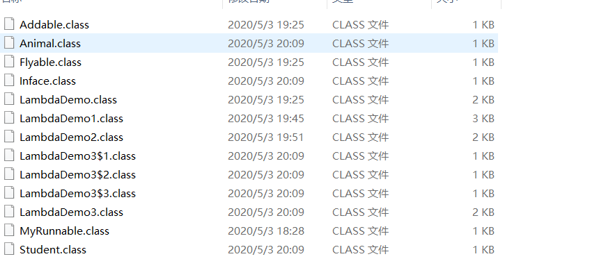
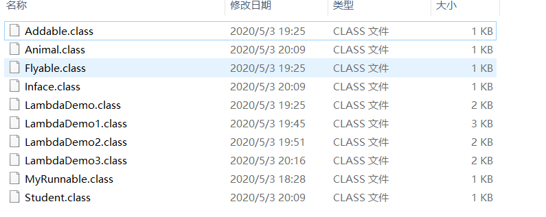

# Lamda表达式

## Lamda表达式的基本定义
```java
public class LambdaDemo {
    public static void main(String[] args) {
        //类方式
//        MyRunnable myRunnable = new MyRunnable();
//        Thread t =new Thread(myRunnable);
//        t.start();

        //匿名内部类
//        new Thread(new Runnable() {
//            @Override
//            public void run() {
//                System.out.println("多线程启动");
//            }
//        }).start();


        //Lambda表达式  有一个接口有且仅有一个抽象方法
        //形参 箭头 代码块
        new Thread(() ->
        {
            System.out.println("启动多线程");
        }).start();

    }
}
```

## Lamda表达式的省略模式
```JAVA
public  class LambdaDemo1 {
    public static void main(String[] args) {
        //省略参数类型
        useAddable((x,y)->{
            return x+y;
        });

        useFlyable((s)->{
            System.out.println(s);
        });

        //只有一个参数 小括号也可以省略
        useFlyable(s->{
            System.out.println(s+"sad");
        });

        //如果代码块只有一行 可以省略 大括号和封号
        useFlyable(s -> System.out.println(s+"sad32"));

        //如果有return 想省略大括号和封号 需要return 也省略
        useAddable((x, y) -> x-y);
    }
    private static void useAddable(Addable a)
    {
        int sum=a.add(10,20);
        System.out.println(sum);
    }
    private static void useFlyable(Flyable f){
        f.fly("哈哈哈哈");
    }

}
```


## Lamda表达式与匿名内部类的区别
```java
package chap19;

/**
 * @program: Head-First-Java-master
 * @description:
 * @author: scorpinxia
 * @create: 2020-05-03 19:57
 **/
public class LambdaDemo3 {
    public static void main(String[] args) {

        useAnimal(new Animal() {
            @Override
            public void method() {
                System.out.println("抽象类");
            }
        });

        useInface(new Inface() {
            @Override
            public void show() {
                System.out.println("接口");
            }
        });

        useStudent(new Student(){
            @Override
            public void study(){
                System.out.println("具体类");
            }
        });

        //useStudent(()-> System.out.println("saew"));
        //useAnimal(()-> System.out.println("具体类"));

        //只能是接口
        useInface(()-> System.out.println("接口s"));


    }

    public static void useInface(Inface i){
        i.show();
    }
    public static void useAnimal(Animal a){
        a.method();
    }
    public static void useStudent(Student s){
        s.study();
    }
}

```

匿名内部类静态编译会产生字节码


Lambda动态生成字节码



# 接口更新 
本身由常量和抽象方法组成

## 默认方法 （java 8）
应用场景 接口升级后（加入新的方法） 需要把所有实现类的地方都重新写过

## 静态方法 java8

只能用接口调用，不能用实现对象，调用

## 私有方法 java9 
为了抽象出默认和静态中的共有


# 方法引用


## 引用对象方法
```java
package chap19;

/**
 * @program: Head-First-Java-master
 * @description:
 * @author: scorpinxia
 * @create: 2020-05-03 20:30
 **/
public class MethodReferenceDemo {

    public static void main(String[] args) {
        usePrintable(s-> System.out.println(s));


        //方法引用  隐含就是把前面的参数给后面的方法
        usePrintable(System.out::println);

        //可推导就是可省略

    }
    public static void usePrintable(Printable p){
        p.printString("hello ");
    }
}

```

## 引用类方法 

## 引用构造方法

# 函数式接口 就是Lambda表达式 （接口只有一个抽象方法）
@FunctionInterface


## java 8 常用函数式接口

### Supplies

```java
package chap19.FunctionInterface;


import java.util.function.Supplier;

/**
 * @program: Head-First-Java-master
 * @description:
 * @author: scorpinxia
 * @create: 2020-05-03 21:13
 **/
public class SupplierDemo {
    public static void main(String[] args) {
        Integer i=getInteger(()-> 3);
        System.out.println(i);

        String s=getString(()->"hello");
        System.out.println(s+"ok");

        int []arr={23,12,32,123};

        int max=getMaxInteger(()->{
            int max1=arr[0];
            for (int it:arr){
                if(it>max1){
                    max1=it;
                }
            }
            return max1;
        });
        System.out.print("max=");
        System.out.println(max);

    }

    private static Integer  getInteger(Supplier<Integer> sup){
        return  sup.get();
    }

    private static String   getString(Supplier<String> sup){
        return  sup.get();
    }

    private static int   getMaxInteger(Supplier<Integer> sup){
        return  sup.get();
    }
}

```


### Consumer 
```java
package chap19.FunctionInterface;

import java.util.function.Consumer;

/**
 * @program: Head-First-Java-master
 * @description:
 * @author: scorpinxia
 * @create: 2020-05-04 20:21
 **/
public class ConsumerDemo {
    public static void main(String[] args) {
        operatorString("scorpin",n-> System.out.println("sd"+n));
        operatorString("scorpin1",System.out::println);

        operatorString("scorpin",n-> System.out.println(new StringBuffer(n).reverse().toString()));


        operatorString("scorpin",n-> System.out.println(new StringBuffer(n).reverse().toString()),n->System.out.println("sd"+n));
    }

    private static void operatorString(String name, Consumer<String> c){
        c.accept(name);
    }

    //不同方式消费两次
    private static void operatorString(String name, Consumer<String> c1,Consumer<String> c2){
//        c1.accept(name);
//        c2.accept(name);

        //c1先消费一次 c2在消费
        c1.andThen(c2).accept(name);
    }
}

```

```java
package chap19.FunctionInterface;

import java.util.function.Consumer;

/**
 * @program: Head-First-Java-master
 * @description:
 * @author: scorpinxia
 * @create: 2020-05-04 20:54
 **/
public class ConsumerDemo1 {
    public static void main(String[] args) {
        String[] strArray={"xia,30","xue,20","xixi,32"};

//        opreatorStringArray(strArray,str->{
//            String name=str.split(",")[0];
//            System.out.print("姓名："+ name);
//        },str1->{
//            String age=str1.split(",")[1];
//            System.out.println("年龄"+age);
//
//        });

        opreatorStringArray(strArray,str-> System.out.print("姓名："+ str.split(",")[0]),str1-> System.out.println("年龄"+str1.split(",")[1]));


    }
    private static void opreatorStringArray(String[] s, Consumer<String> c1,Consumer<String> c2){
        for (String s1:s) {
            c1.andThen(c2).accept(s1);
        }

    }
}

```
### Predicate

```java
package chap19.FunctionInterface;

import java.util.function.Predicate;

/**
 * @program: Head-First-Java-master
 * @description:
 * @author: scorpinxia
 * @create: 2020-05-04 23:04
 **/
public class PredicateDemo {
    public static void main(String[] args) {
        boolean isMorethan8 =checkString("rqwtg",str-> str.length()>8);
        System.out.println(isMorethan8);

        boolean isMorethan82 =checkString("adawrwqrqw",str-> str.length()>8);
        System.out.println(isMorethan82);

        boolean b =checkString("adawrwqrqw",str-> str.length()>8,str1->str1.length()<15);
        System.out.println(b);
    }
    private static boolean checkString(String s, Predicate<String> pre){
        //return pre.test(s);


        //逻辑非 不是!pre.test(s);
        return pre.negate().test(s);
    }

    private static boolean checkString(String s, Predicate<String> pre1,Predicate<String> pre2){
//        boolean test1 = pre1.test(s);
//        boolean test2 = pre2.test(s);
//        boolean result = test1 && test2;
//        return result;

        //与上面一致

          return pre1.and(pre2).test(s);

          //OR 同理
          //return  pre1.or(pre2).test(s);
    }
}

```


### Function
```java
package chap19.FunctionInterface;

import java.util.function.Function;
import java.util.stream.Stream;

/**
 * @program: Head-First-Java-master
 * @description:
 * @author: scorpinxia
 * @create: 2020-05-05 22:14
 **/
public class FunctionDemo {
    public static void main(String[] args) {
        covert("23412",str->Integer.parseInt(str));
        covert1(324,i->String .valueOf(i+10));

        int i=8;

        covert1("23412",str-> String .valueOf(Integer.parseInt(str)+i));

        covert1("10",str->Integer.parseInt(str),i1->String.valueOf(i1+i));
    }


    private static void covert(String s, Function<String,Integer> fun){
        int i=fun.apply(s);
        System.out.println(i);
    }
    private static void covert1(int i, Function<Integer,String> fun){
        String  s=fun.apply(i);
        System.out.println(s);
    }

    private static void covert1(String s, Function<String,String> fun){
        String  s1=fun.apply(s);
        System.out.println(s1);
    }

    private static void covert1(String s, Function<String,Integer> fun1,Function<Integer,String> fun2){
//        int i=fun1.apply(s);
//        String s1=fun2.apply(i);
//        System.out.println(s1);

        //同
        String s1=fun1.andThen(fun2).apply(s);
        System.out.println(s1);
    }

}

```

# Strem 流

## 生成流
list.strem()

Colletions 体系集合默认方法stream
Map 体系集合间接生成流
数组 Stream的静态方法


## 中间操作
fliter()

## 终结操作
foreach
