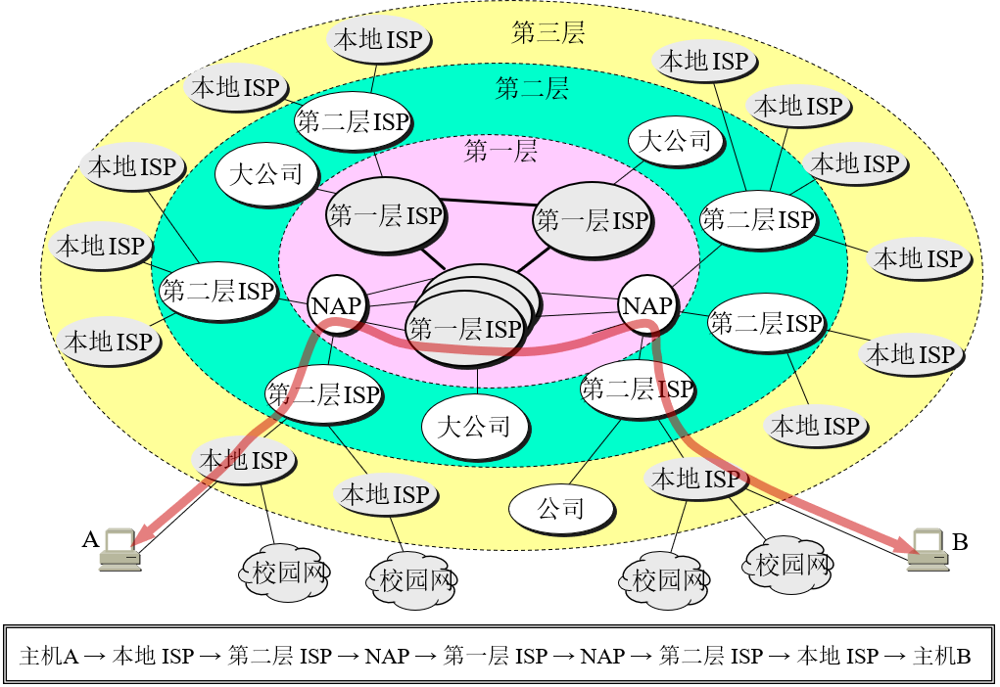
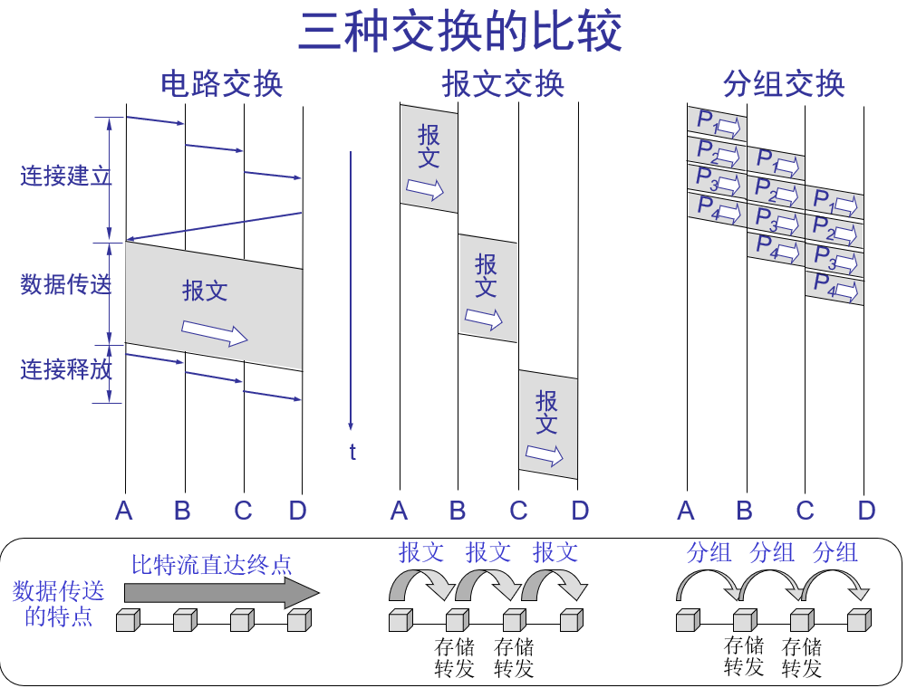
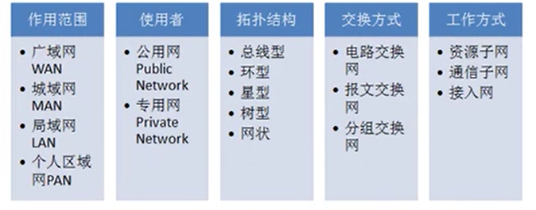
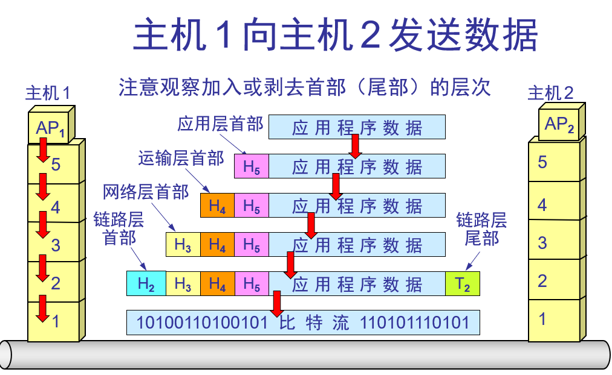
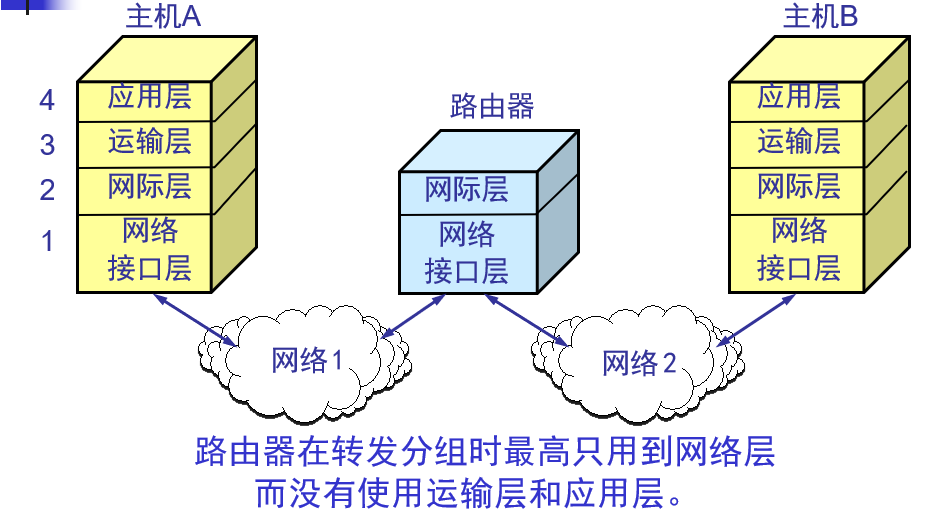

<!-- TOC -->

- [1. Internet（因特网) 和 internet（互联网)](#1-internet因特网-和-internet互联网)
- [2. 主机通信方式](#2-主机通信方式)
    - [2.1. CS](#21-cs)
    - [2.2. P to P](#22-p-to-p)
- [3. 数据交换方式](#3-数据交换方式)
    - [3.1. 电路交换](#31-电路交换)
    - [3.2. 分组交换](#32-分组交换)
    - [3.3. 报文交换](#33-报文交换)
- [4. 各种类型网络划分](#4-各种类型网络划分)
- [5. 路由器 (router)](#5-路由器-router)
- [6. 国际标准 OSI/RM  实际标准 TCP/IP](#6-国际标准-osirm--实际标准-tcpip)
- [7. 各层操作](#7-各层操作)
- [8. 路由器只用了网络层](#8-路由器只用了网络层)

<!-- /TOC -->

# 1. Internet（因特网) 和 internet（互联网)

Internet（因特网）全球最大的网络
internet（互联网) 多个计算机网络互连
ISP（Internet services provider)

# 2. 主机通信方式 
## 2.1. CS 
## 2.2. P to P 
使用P2P 软件 对等连接 不区分请求和提供
# 3. 数据交换方式 

## 3.1. 电路交换
直接线或者加上交换机连起来 
## 3.2. 分组交换
将报文分段 重组
## 3.3. 报文交换

# 4. 各种类型网络划分

# 5. 路由器 (router)
转发收到数据报分组

# 6. 国际标准 OSI/RM  实际标准 TCP/IP
TCP 4层  网络接口层分为 数据链路和物理层

# 7. 各层操作

# 8. 路由器只用了网络层

