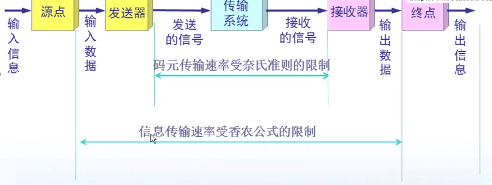
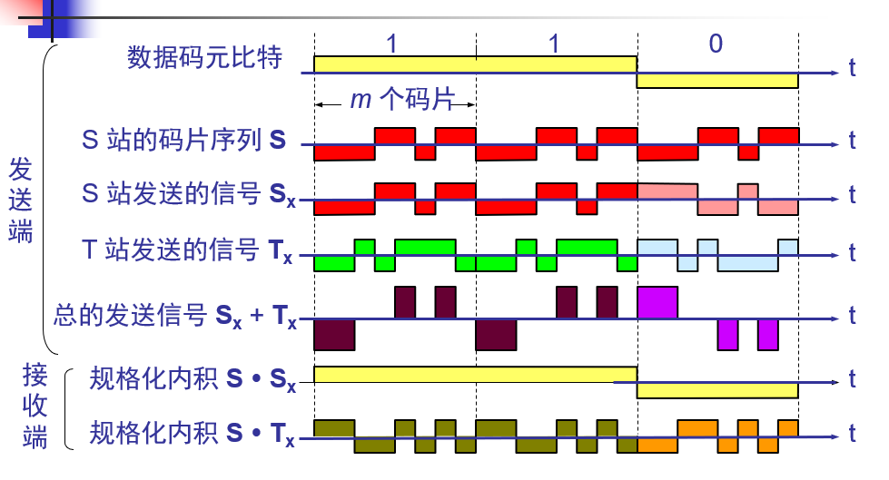

<!-- TOC -->

- [1. 单工 半双工 双工](#1-单工-半双工-双工)
- [2. 奈氏准则 香农公式](#2-奈氏准则-香农公式)
    - [2.1. 奈氏准则](#21-奈氏准则)
    - [2.2. 香农公式](#22-香农公式)
- [3. FDM TDM WDM(光的FDM) CDM](#3-fdm-tdm-wdm光的fdm-cdm)
- [4. ADSL 拨号上网](#4-adsl-拨号上网)

<!-- /TOC -->
# 1. 单工 半双工 双工

# 2. 奈氏准则 香农公式

## 2.1. 奈氏准则
奈氏准则 多高频 传输快无串扰
## 2.2. 香农公式
信噪比和带宽

# 3. FDM TDM WDM(光的FDM) CDM
CDMA 利用正交 不同码元 正交0 

# 4. ADSL 拨号上网