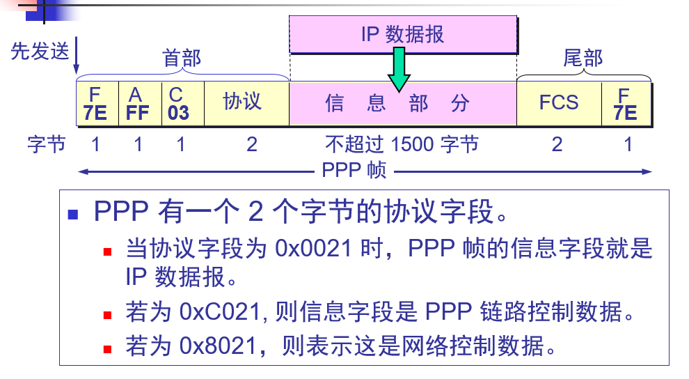

<!-- TOC -->

- [1. 信道方式](#1-信道方式)
    - [1.1. 点对点信道](#11-点对点信道)
        - [1.1.1. 传输步骤](#111-传输步骤)
            - [1.1.1.1. 封装成帧](#1111-封装成帧)
            - [1.1.1.2. 透明传输](#1112-透明传输)
            - [1.1.1.3. 差错控制](#1113-差错控制)
        - [1.1.2. PPP协议](#112-ppp协议)
    - [1.2. 广播信道](#12-广播信道)
        - [1.2.1. 局域网](#121-局域网)
        - [1.2.2. 网卡（网络适配器）](#122-网卡网络适配器)
        - [1.2.3. 以太网 CSMA/CD （一种局域网)](#123-以太网-csmacd-一种局域网)
        - [1.2.4. MAC地址](#124-mac地址)
        - [1.2.5. 集线器](#125-集线器)
            - [1.2.5.1. 集线器扩展](#1251-集线器扩展)
        - [1.2.6. 网桥](#126-网桥)
            - [1.2.6.1. 透明网桥](#1261-透明网桥)
        - [1.2.7. 交换机 （网桥 + 集线器）](#127-交换机-网桥--集线器)
        - [1.2.8. VLAN (与位置无关和功能有关)](#128-vlan-与位置无关和功能有关)

<!-- /TOC -->
# 1. 信道方式
传输 数据帧
## 1.1. 点对点信道
### 1.1.1. 传输步骤
#### 1.1.1.1. 封装成帧
加首部 尾部
#### 1.1.1.2. 透明传输
添加转义 防止数据里面有帧尾
#### 1.1.1.3. 差错控制
CRC 循环码  是FSC(Frame squence check)的一种
无差错接受
### 1.1.2. PPP协议

## 1.2. 广播信道 
### 1.2.1. 局域网
### 1.2.2. 网卡（网络适配器）
### 1.2.3. 以太网 CSMA/CD （一种局域网)

### 1.2.4. MAC地址
2^48 次方个 

### 1.2.5. 集线器
相当于总线

#### 1.2.5.1. 集线器扩展

### 1.2.6. 网桥
根据转发目的

#### 1.2.6.1. 透明网桥
自学习 生成树

### 1.2.7. 交换机 （网桥 + 集线器）
全双工 独占信道

### 1.2.8. VLAN (与位置无关和功能有关)

