<!-- TOC -->

- [1. 概述](#1-概述)
    - [1.1. 软件端口](#11-软件端口)
    - [1.2. 传输层和应用层关系](#12-传输层和应用层关系)
    - [1.3. 应用层协议和服务之前的关系](#13-应用层协议和服务之前的关系)
    - [1.4. 防火墙与木马原理](#14-防火墙与木马原理)
- [2. 用户数据报协议 UDP(User Datagram Protocol)](#2-用户数据报协议-udpuser-datagram-protocol)
- [3. 传输控制协议 TCP(Transmission Control Protocol)](#3-传输控制协议-tcptransmission-control-protocol)
    - [3.1. 可靠传输](#31-可靠传输)
        - [3.1.1. 停止等待](#311-停止等待)
        - [3.1.2. 连续ARP](#312-连续arp)
        - [3.1.3. 窗口](#313-窗口)
        - [3.1.4. 超时重传时间](#314-超时重传时间)
    - [3.2. 报文段首部](#32-报文段首部)
    - [3.3. 流量控制](#33-流量控制)
    - [3.4. 拥塞控制](#34-拥塞控制)
        - [3.4.1. 与流量控制关系](#341-与流量控制关系)
        - [3.4.2. 慢开始](#342-慢开始)
    - [3.5. 三次握手](#35-三次握手)
        - [3.5.1. 建立连接后状态](#351-建立连接后状态)
            - [3.5.1.1. 需要wait2ms原因](#3511-需要wait2ms原因)
        - [3.5.2. 状态机](#352-状态机)

<!-- /TOC -->
# 1. 概述
边缘的主机才有协议栈，路由器只用下三层
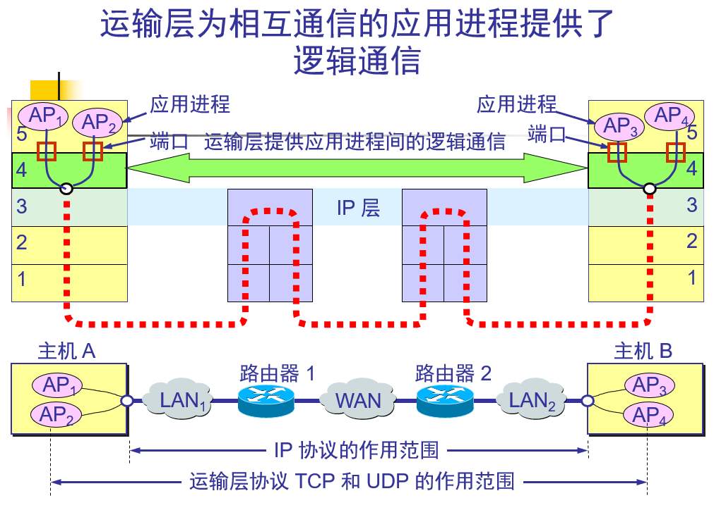
## 1.1. 软件端口
* 熟知端口，数值一般为 0~1023。
* 登记端口号，数值为1024~49151，为没有熟知端口号的应用程序使用的。使用这个范围的端口号必须在 IANA 登记，以防止重复。
* 客户端口号或短暂端口号，数值为49152~65535，留给客户进程选择暂时使用。当服务器进程收到客户进程的报文时，就知道了客户进程所使用的动态端口号。通信结束后，这个端口号可供其他客户进程以后使用。 

## 1.2. 传输层和应用层关系
http = TCP +80
https =TCP +443
ftp = TCP+21
SMTP=TCP+25
POP3=TCP+110
RDP=TCP+3389
共享文件夹 = TCP+445
SQL=CTP+1433
DNS =UDP +53 or TCP +53
## 1.3. 应用层协议和服务之前的关系
通过端口监听
可以更改服务端口
也可以只开哪些口
mstsc 远程桌面

## 1.4. 防火墙与木马原理 
是把端口关闭  ping都ping 不通  
可以ping别人 ，**拦截进来的** ，不拦截出去的
防火墙防不了木马 **木马是连远程服务（出去的）**
从本地安全连接可以控制出入
# 2. 用户数据报协议 UDP(User Datagram Protocol)
首部
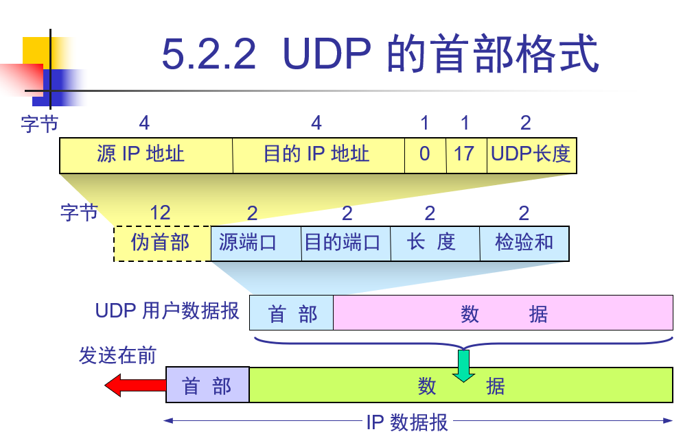
传输的UDP报文或用户数据报（与网络层的ip数据报有区别)
特点：
* 不可靠逻辑信道 尽可能交付
* 不连接 不确认
* 无拥塞控制  适合多媒体
* 支持一对一、一对多、多对一和多对多的交互通信。
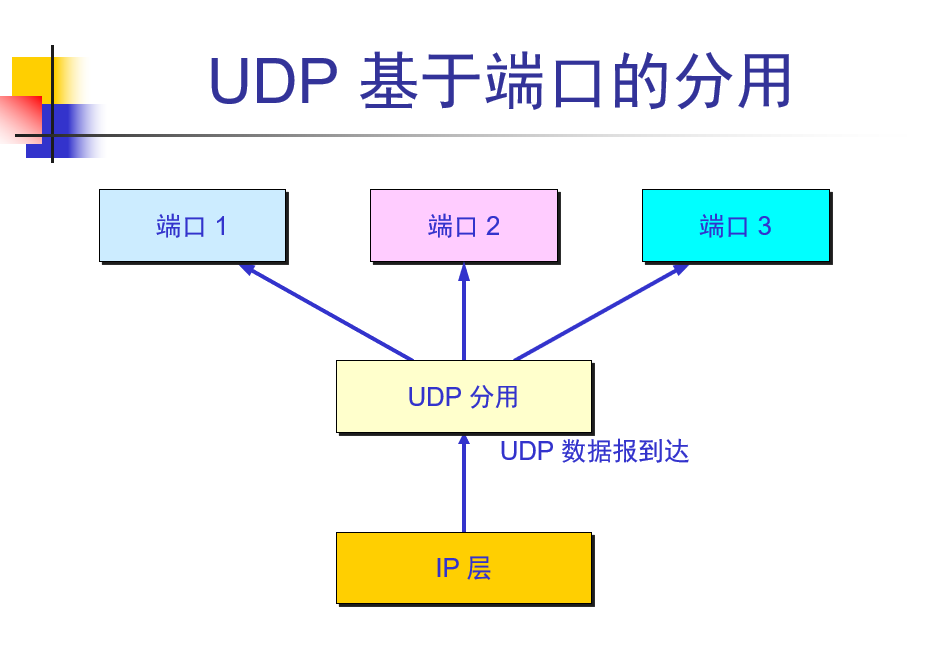
* 一次发一个报文不管多大 需要应用程序控制发多大
# 3. 传输控制协议 TCP(Transmission Control Protocol)

特点：
* 可靠全双工逻辑信道
* 传输的TCP报文段（segment）
* 分段 编号 流量控制 建立会话 netstat -n 可靠
* 只能一对一

## 3.1. 可靠传输
### 3.1.1. 停止等待
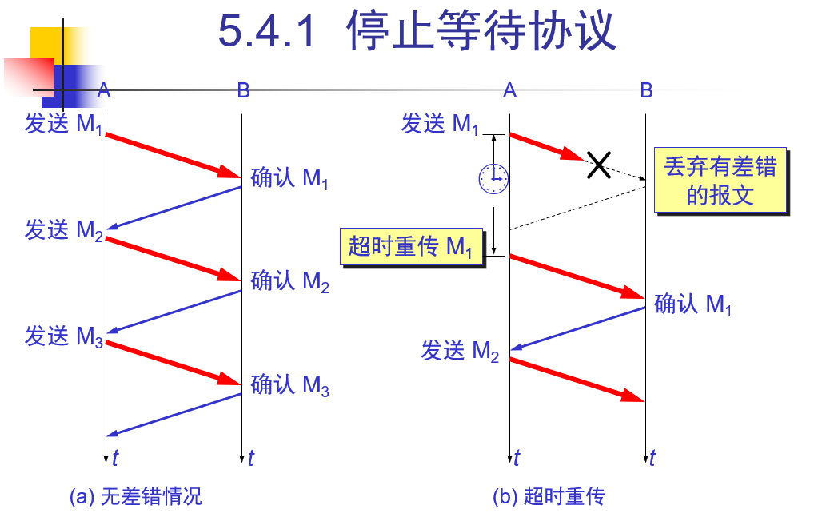
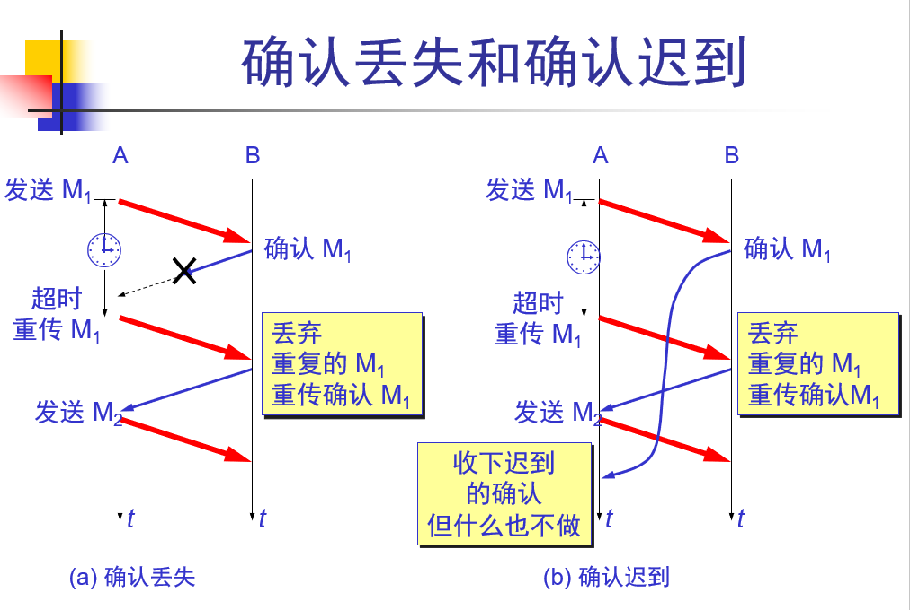
普通ARP（Automatic Repeat reQuest)信道利用率太低了
### 3.1.2. 连续ARP
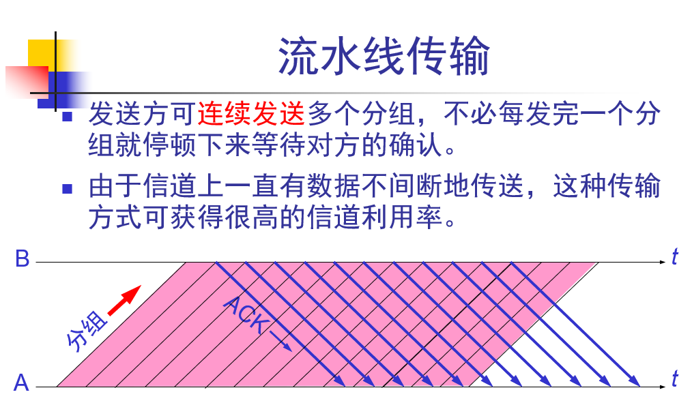
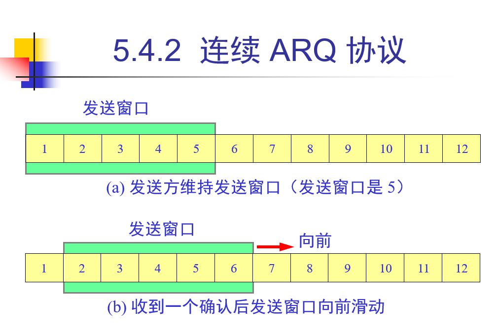
累计确认不把每个字节确认 确认一堆 

### 3.1.3. 窗口
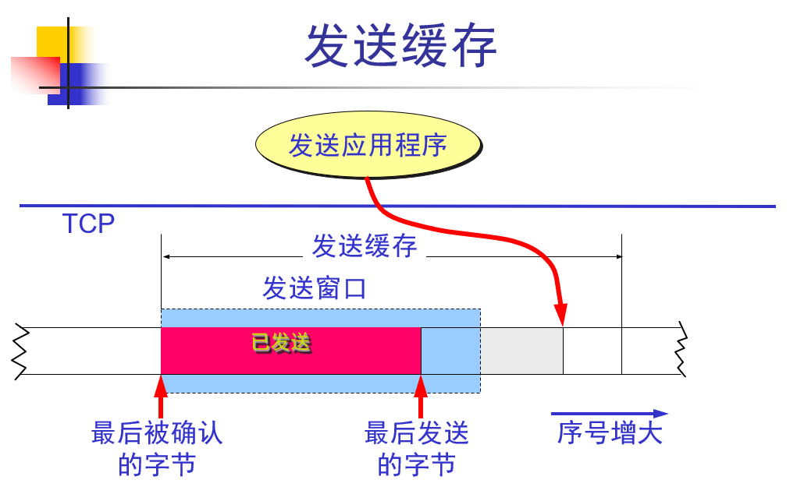
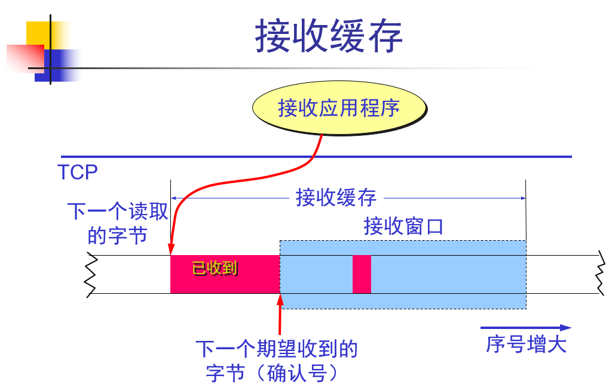
### 3.1.4. 超时重传时间
complex
特点：
* TCP 连接的每一端都必须设有两个窗口——一个发送窗口和一个接收窗口。
* TCP 的可靠传输机制用字节的序号进行控制。TCP 所有的确认都是基于序号而不是基于报文段。
* TCP 两端的四个窗口经常处于动态变化之中。
* TCP连接的往返时间 RTT 也不是固定不变的。需要使用特定的算法估算较为合理的重传时间。  

## 3.2. 报文段首部
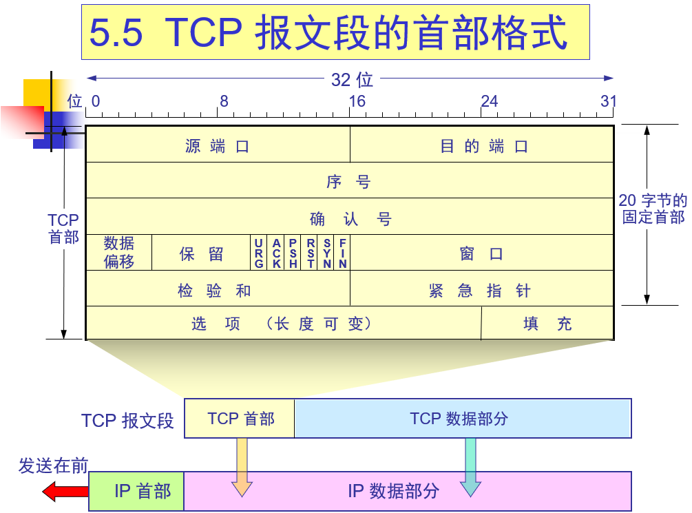
* 序号： 发送的第一个字节序号
* 确认号：期望收到对方的下一个报文段数据的第一个字节号
* 偏移：指出真正的TCP报文段在哪
* URG：紧急数据 优先传输
* **ACK**：=1 确认号才有用
* PSH：收到 PSH = 1 的报文段，就尽快地交付接收应用进程，而不再等到整个缓存都填满了后再向上交付。  
* RST (ReSeT) —— 当 RST=1 时，表明 TCP 连接中出现严重差错（如由于主机崩溃或其他原因），必须释放连接，然后再重新建立运输连接。 
* **SYN**：同步
* **FIN**：用来释放一个连接。FIN = 1 表明此报文段的发送端的数据已发送完毕，并要求释放运输连接。 
* 发送窗口：让对方设置发送窗口的依据 （最大65535)

## 3.3. 流量控制
利用窗口
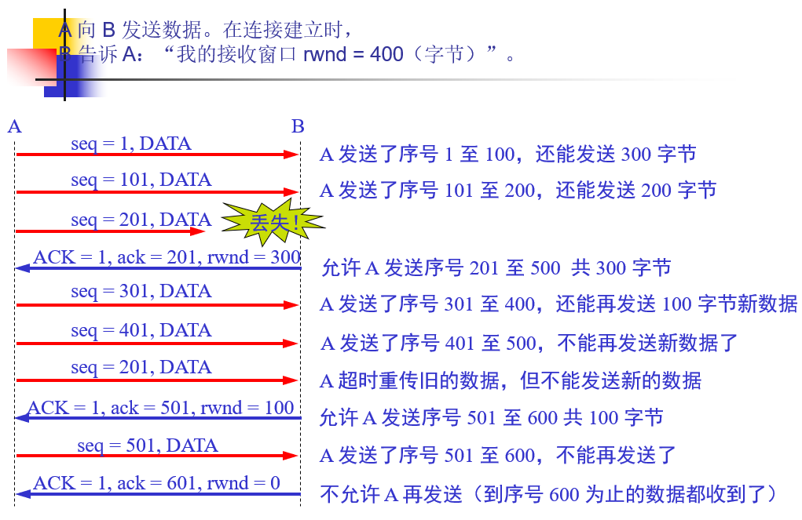

## 3.4. 拥塞控制
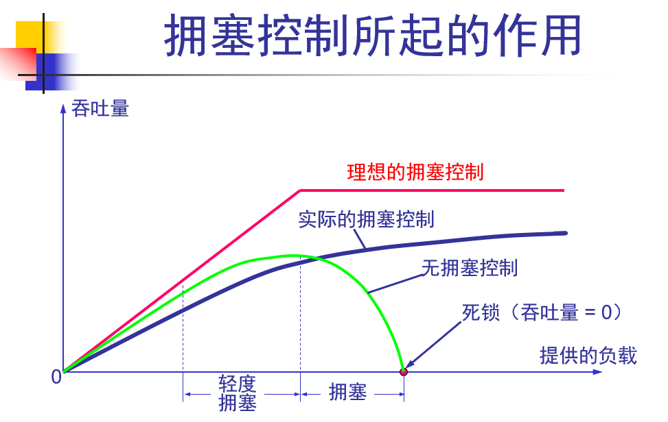
### 3.4.1. 与流量控制关系
* 拥塞控制就是网络能够承受现有的网络负荷。
拥塞控制是一个全局性的过程，涉及到所有的主机、所有的路由器，以及与降低网络传输性能有关的所有因素。 
* 流量控制往往指在给定的发送端和接收端之间的点对点通信量的控制。 流量控制所要做的就是抑制发送端发送数据的速率，以便使接收端来得及接收。 

### 3.4.2. 慢开始
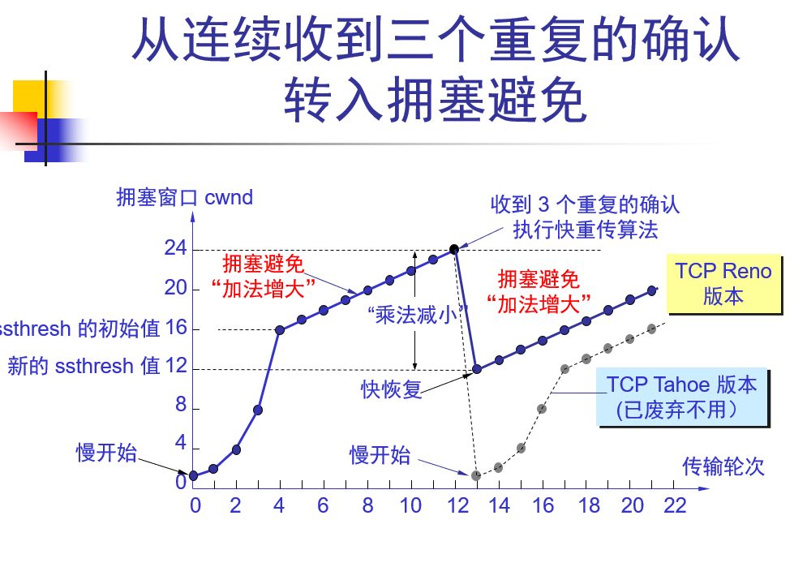
## 3.5. 三次握手
**为什么要三次 两次不就 回来了吗**
>要是两次的话 服务器发过去的那个丢了 服务器会认为以及建立了 
客户端认为还没回 然后就不发 这就卡着了
三次 的话 服务器看到没回 就接着发建立 

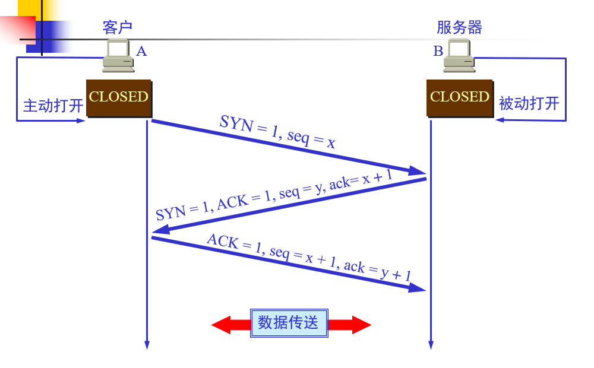

### 3.5.1. 建立连接后状态
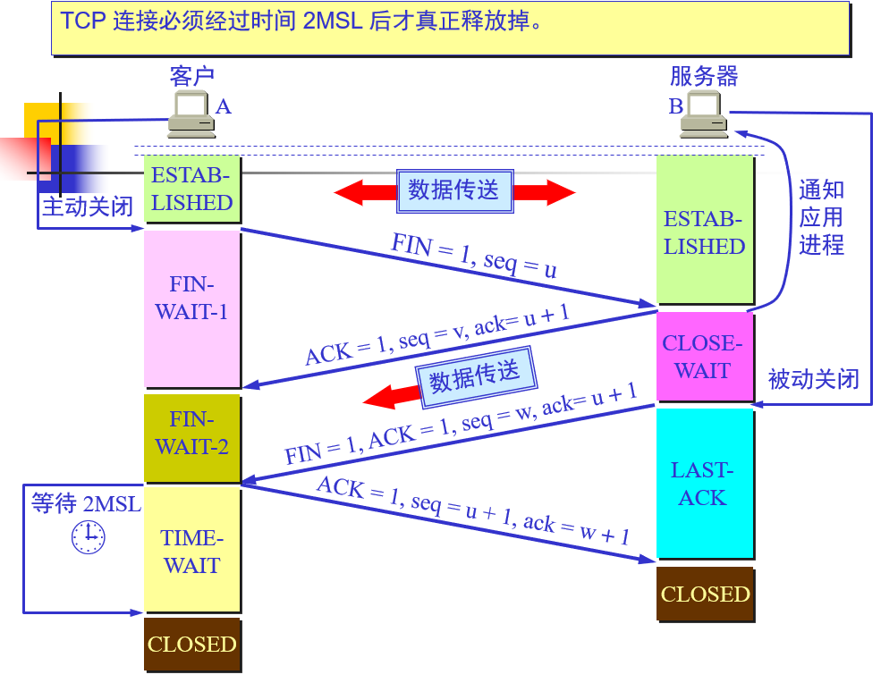
#### 3.5.1.1. 需要wait2ms原因
第一，为了保证 A 发送的最后一个 ACK 报文段能够到达 B。
第二，防止 “已失效的连接请求报文段”出现在本连接中。A 在发送完最后一个 ACK 报文段后，再经过时间 2MSL，就可以使本连接持续的时间内所产生的所有报文段，都从网络中消失。这样就可以使下一个新的连接中不会出现这种旧的连接请求报文段。

### 3.5.2. 状态机
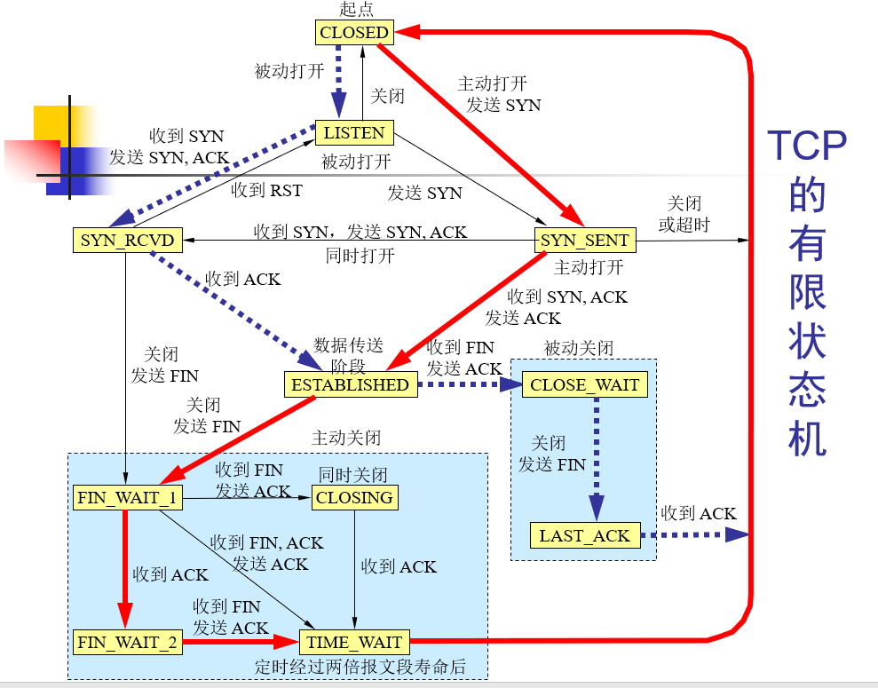