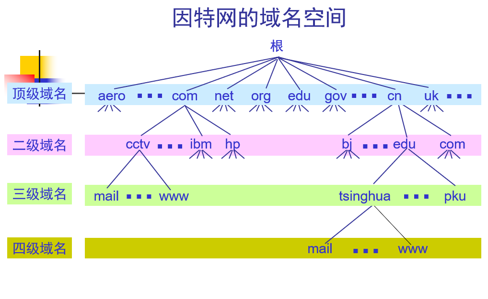
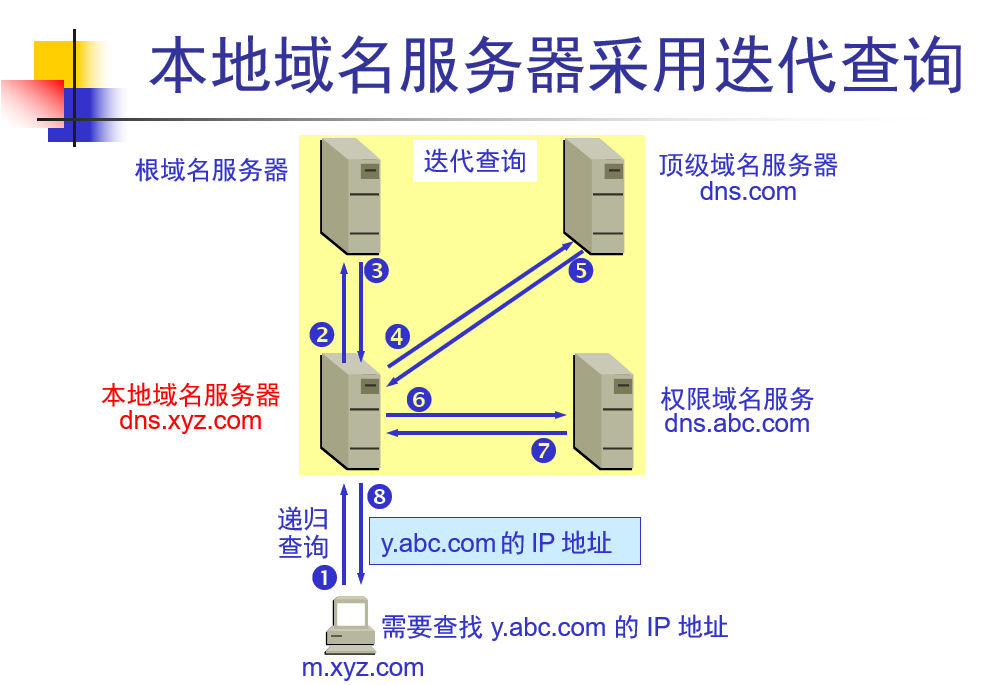
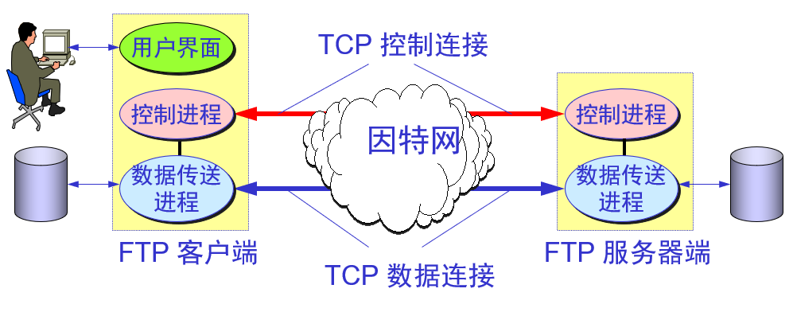
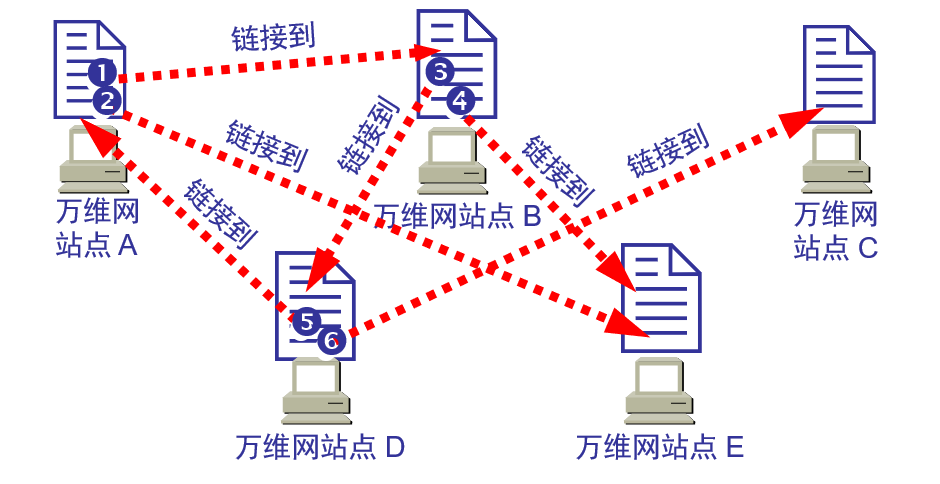
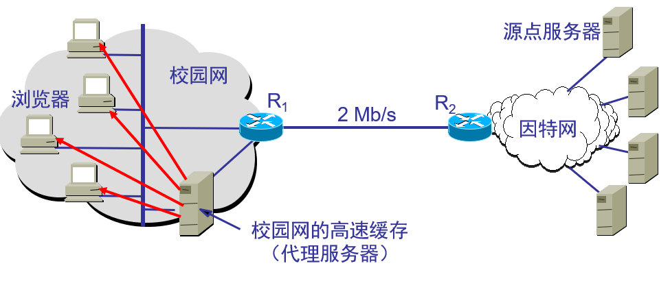
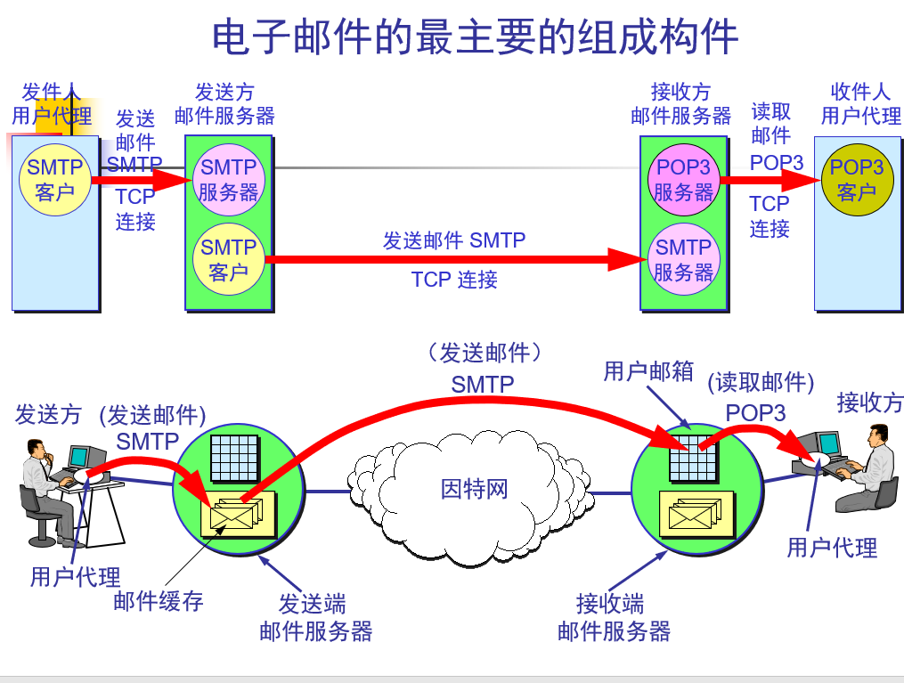
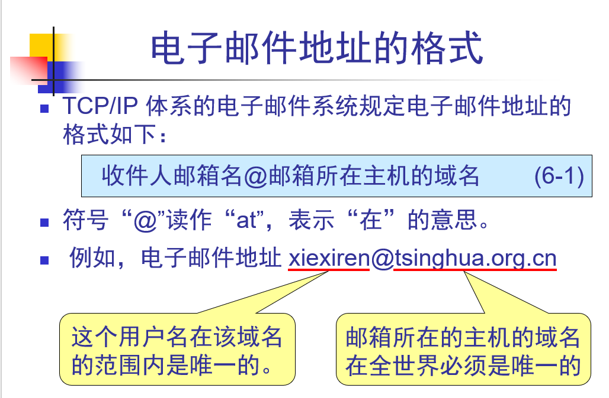
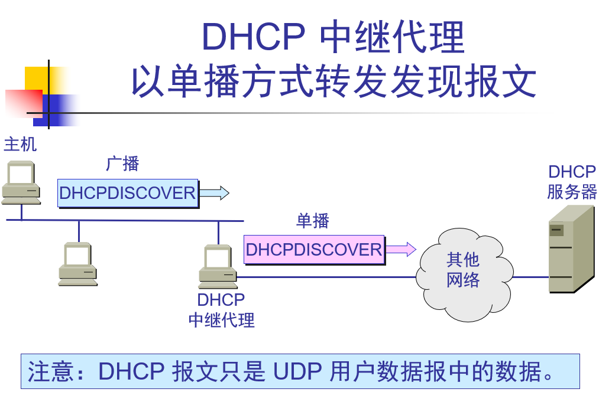

# DNS domain name system
域名到IP
多级域名

分级解析 找根 后再分配
直接ping域名 ping www.baidu.com 
nslookup www.baidu.com 查ip
## 解析过程

13套根
非授权域名 只能出去找
www.xxxx.xx  www是主机
ftp.xxx.xxx ftp 是主机

## 安装自己的DNS服务器好处
配置自己的DNS windows service
* 解析内网域名  降低到Internet 域名解析
* 域环境

# FTP file transfer protocol
屏蔽系统传输

## 两种模式
* 主动模式
ftp客户端 告诉服务器使用说明端口侦听 主动连 客户端  （开防火墙）
服务器端口
21 控制
20 数据传输

* 被动模式
ftp服务器就和端口建立连接
服务器被动打开一个 等待  
服务器端口
21 控制
xxxx 数据传输

## NFS 
远程修改文件

# talnet 远程终端
23端口
net user administrator al! 更改用户密码
net user han al! /add 添加用户
加端口 变成端口扫描

# www 万维网
一个站点访问另一个站点

## 工作方式
他是客户服务器
浏览器就是客户程序

## 需求问题

### URL
标识独一资源

### Http 
客户机和服务器使用http协议通信
### html 
实现到各个地方 
### 搜索引擎

## 搭建HTTP服务
服务器有 不同网站采取方式
*  可以用不同端口  
* 服务器多加地址 保存默认都是80
* 只有一个公网地址  使用不同主机头只能用域名访问 

## proxy server (代理服务器)

### 使用web 代理服务器访问网站
1. 节省内网访问internet带宽 （甚至不用网关）（静态）
2. 利用web服务器翻墙
3. 使用web 服务器代理 而 不让人知道 谁发的帖子（所以要实名）

## Cookie
跟踪用户活动传递用户状态

# 邮件
发送邮件的协议：SMTP
读取邮件的协议：POP3 和 IMAP

## 过程
中继过程要，要邮局转发  
过程，域里面一个邮箱写一份信，给服务器，服务器查DNS ，放到另一个服务器里，然后另一个服务器域里的邮箱在去收下来

在服务器pop3、IMAP服务（收） STMP（发）上创建邮箱

## 邮箱格式

域下面加邮箱

# DHCP
## 获取ip过程
向dhcp服务器广播，同网段所有计算机都能收到，但是DHCP服务器回应
先在数据库查是不是配过，没有得话在ip池分配

## 跨网段
并不是每个网段都有DHCP服务器，但至少有一个代理

服务器静态ip
本网段 广播就直接得到不用经过路由了 
在路由上加ip helper address （只需要在接着主机的地址配就行，然后收到网关，就会去找DHCP，跨网段 DHCP

# RDP远程桌面 
linux winserver多用户同时访问操作系统
xpwin7win8win10单用户
不想用管理员 可以用远程桌面组
还可以映射硬盘过去连远程
